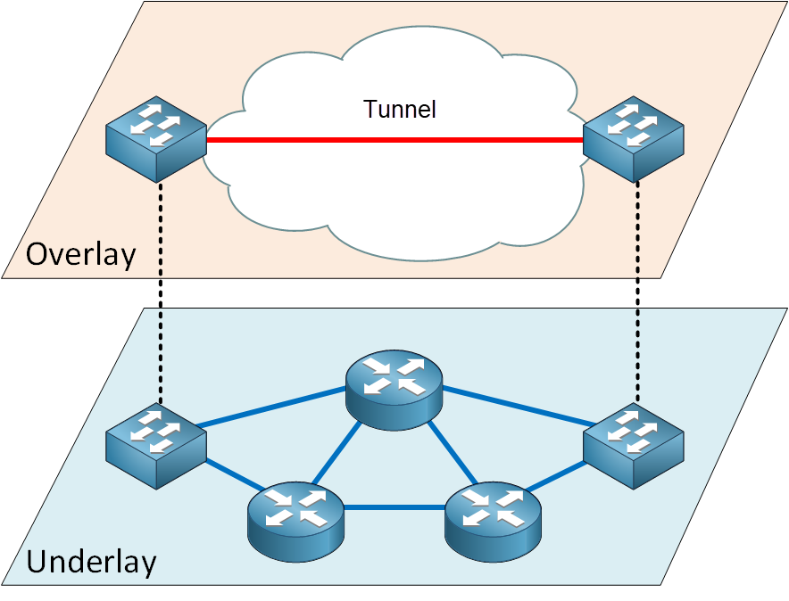
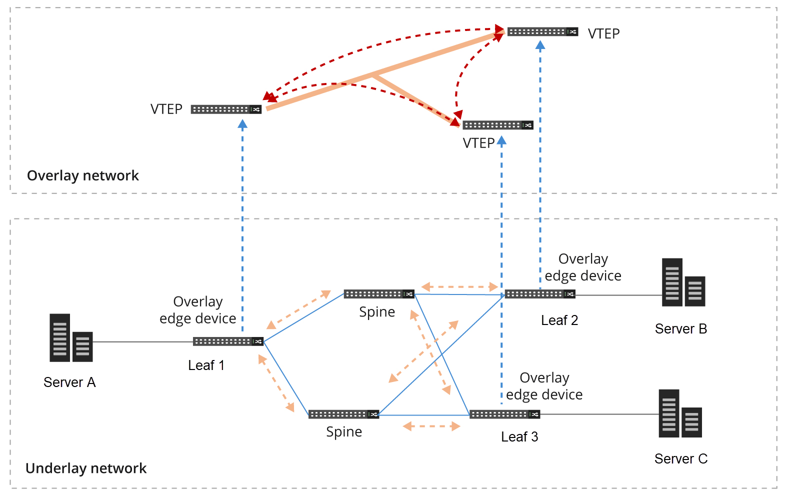
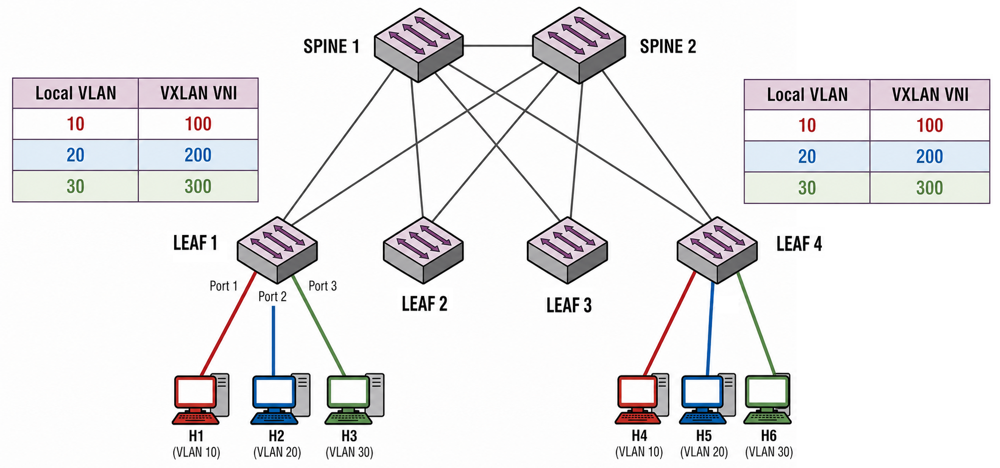
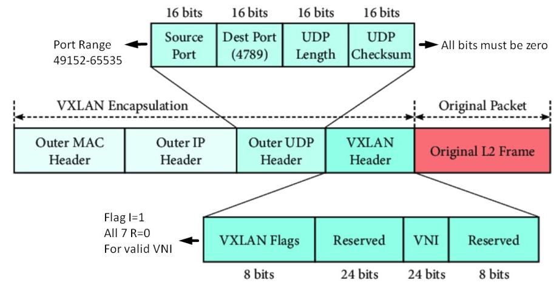
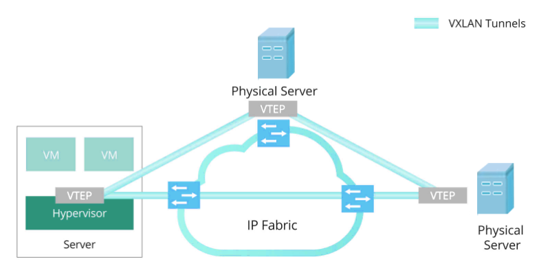

# Virtual Extensible LAN (VXLAN)

## The Prerequisite Concepts

### The Underlay Network (The Physical Foundation)

The underlay is the real, physical network infrastructure inside a data center: the cables, Top-of-Rack (ToR) leaf switches, and spine switches, typically arranged in a Clos topology. Unlike legacy networks that relied on Spanning Tree Protocol (STP) to block redundant paths and prevent loops at Layer 2, a modern underlay operates entirely at Layer 3. Every switch-to-switch link is a routed IP interface, and dynamic routing protocols (like OSPF, IS-IS, or BGP) build the forwarding tables. This allows all links to be active simultaneously, providing massive bandwidth and redundancy via Equal-Cost Multi-Path (ECMP) routing.

However, a pure Layer 3 network cannot natively transport Layer 2 traffic across different subnets. This is the exact limitation that the next concept, the overlay, is designed to solve.

### The Overlay Network (The Virtual Illusion)

If the underlay is the physical highway system, the overlay is a series of dedicated, virtual tunnels built on top of those highways. The overlay allows isolated endpoints (like legacy servers or virtual machines) to believe they are residing on the exact same flat, Layer 2 network even if they are physically located in completely different server racks or geographic data centers.

The diagram below shows two separate planes: the physical underlay and the logical overlay. The bottom plane depicts the physical infrastructure — a routed mesh of interconnected switches and routers. The top plane represents the virtual network, showing how a direct, logical tunnel (the red line) connects two edge devices. The vertical dashed lines illustrate how these virtual endpoints map down to the underlying hardware, highlighting how the overlay abstracts the multi-hop routing of the physical fabric beneath it.

### Encapsulation (MAC-in-UDP Tunneling)

To push flat Layer 2 traffic across a routed Layer 3 underlay, the network must use encapsulation. Encapsulation takes the original, standard Ethernet frame generated by a server and wraps it entirely inside a new UDP/IP packet. The physical underlay switches only read and route the outer IP headers; they are completely blind to the original payload inside.

## Understanding VXLAN

VXLAN creates a virtual Layer 2 network (overlay) on top of a physical Layer 3 network (underlay). Think of it as a tunnel that makes two distant switches believe they are directly connected at Layer 2. It is designed specifically to overcome the scaling and geographic constraints of traditional 802.1Q VLANs. VXLAN was standardized by the IETF in [RFC 7348](https://datatracker.ietf.org/doc/html/rfc7348) (2014).

### The VNI: Solving the 4,096 Limit

Traditional VLANs use a 12-bit identifier, which hard-caps a network at 4,094 usable segments. In large-scale enterprise data centers or multi-tenant cloud environments, this address space runs out rapidly. VXLAN replaces the traditional VLAN ID with a **VXLAN Network Identifier** (VNI). The VNI utilizes a 24-bit field, which immediately expands the address space to over 16 million unique, isolated network segments.

### The VTEP: The Packaging Facility

Since the underlying physical network only routes IP packets, there must be a translation point where standard Layer 2 frames are packaged into VXLAN tunnels before crossing the fabric. This is handled by a **VXLAN Tunnel Endpoint (VTEP)**, which acts as the edge of the overlay network, performing the encapsulation (ingress) and decapsulation (egress) of VXLAN packets.

In a modern data center fabric, this role is usually fulfilled by a hardware VTEP — a physical switch equipped with native VXLAN support. Encapsulation and decapsulation are performed directly in the hardware ASICs at full line rate, eliminating latency and processing bottlenecks. This is typically deployed as a Top-of-Rack (ToR) leaf switch in a leaf-spine architecture. Operating at the fabric edge, the hardware VTEP performs two primary functions:

- **Downstream**: It connects to standard servers and compute nodes using traditional, untagged Ethernet or standard 802.1Q VLANs.
- **Upstream**: It connects to the spine switches via routed Layer 3 links.

The following diagram illustrates the dual nature of a VTEP. In the bottom Underlay plane, servers connect to physical Leaf switches, which route traffic through a mesh of Spine switches. As shown by the vertical mapping lines, those physical Leaf switches act as the VTEPs in the virtual plane above. In this top Overlay network, the VTEPs establish direct, logical tunnels to one another, completely abstracting away the multi-hop physical routing happening in the underlay fabric.

### VLAN-to-VNI Mapping: How Traffic Enters the Tunnel

A VTEP does not blindly encapsulate everything it receives. On its downstream-facing ports (toward servers), the leaf switch still operates as a normal Layer 2 switch with one or more VLANs configured. Traffic arriving on these ports can be either untagged (access port) or 802.1Q tagged (trunk port), just like any traditional switch. The key difference is what happens next: instead of simply switching the frame locally, the VTEP maps each local VLAN to a specific VNI and encapsulates the frame into the corresponding VXLAN tunnel.

This mapping is explicitly configured by the network engineer on every leaf switch. For example, consider two leaf switches each hosting servers from three different departments:

| Local VLAN | Department  | Mapped VNI |
|------------|-------------|------------|
| VLAN 10    | Engineering | VNI 100    |
| VLAN 20    | Finance     | VNI 200    |
| VLAN 30    | HR          | VNI 300    |

When a server on Leaf 1 plugged into an access port assigned to VLAN 10 sends a frame, the VTEP checks its mapping table, sees that VLAN 10 corresponds to VNI 100, and encapsulates the frame with that VNI in the VXLAN header. When the frame arrives at Leaf 4, the remote VTEP reads VNI 100 from the VXLAN header, maps it back to its own local VLAN 10, strips the encapsulation, and delivers the original frame to the correct downstream port.

The local VLAN IDs on each leaf do not need to match. Leaf 1 could use VLAN 10 for Engineering while Leaf 4 uses VLAN 100 for the same department — as long as both map to the same VNI (100), the servers will share the same virtual Layer 2 segment across the fabric. The VNI is the fabric-wide identity; the local VLAN is just a port-level classifier on each individual switch.

A single VTEP typically hosts many VNIs simultaneously, and a single tunnel between two VTEPs carries traffic for all VNIs that both sides share. There is no separate tunnel per VNI — the VNI field inside each VXLAN header is what distinguishes one virtual segment from another over the same tunnel. This means a leaf switch serving dozens of VLANs only needs one tunnel endpoint per remote VTEP, keeping the control plane lightweight regardless of how many network segments traverse the fabric.

> **Note:** The complete lifecycle of a frame — from server egress through VLAN classification, VNI mapping, encapsulation, underlay transit, and decapsulation — is covered in detail in the [Step-by-Step: How a VXLAN Packet Travels](#step-by-step-how-a-vxlan-packet-travels) section.

### The VTEP IP Address: The Tunnel Anchor

Every VTEP must have a dedicated, unique IP address to act as the permanent anchor point for its VXLAN tunnels. In a physical network switch, this is almost always configured as a Loopback interface. A Loopback is a logical, virtual interface inside the switch that never goes "down" as long as the switch is powered on. This provides a highly stable, always-on endpoint, ensuring that even if a specific physical cable gets unplugged, the tunnel remains active via redundant physical paths.

Once configured, this VTEP Loopback IP is injected into the underlay network's dynamic routing protocol (such as OSPF or BGP). By doing this, the routing protocol maps out the fabric, and every single spine and leaf switch learns exactly how to route traffic to that specific VTEP. Later, when the VTEP encapsulates a server's frame and builds the "Outer IP Header," it uses its own Loopback IP as the Source IP, and the remote VTEP's Loopback IP as the Destination IP.

### The VXLAN Frame Format

To achieve this tunneling, the VTEP takes the original Ethernet frame generated by the server and wraps it in a series of new headers before sending it across the physical network. This process is known as MAC-in-UDP encapsulation. The resulting VXLAN packet consists of the following layers:

- Outer MAC Header (14 bytes)
  - **Destination MAC:** Next-hop MAC in the underlay (the router/switch toward remote VTEP).
  - **Source MAC:** Local VTEP's physical interface MAC.
  - **EtherType:** 0x0800 (IPv4) or 0x86DD (IPv6).

- Outer IP Header (20 bytes for IPv4)
  - **Source IP:** Local VTEP IP address.
  - **Destination IP:** Remote VTEP IP address.
  - **Protocol:** 17 (UDP).
  - **TTL:** Typically set to a high value (default varies by platform).
  - **DF bit:** Typically set (Do Not Fragment), requiring the underlay MTU to accommodate the overhead.

- Outer UDP Header (8 bytes)
  - **Source Port:** A hash of the inner frame's headers (src/dst MAC, src/dst IP, protocol). This provides entropy for ECMP load balancing in the underlay. The source port varies per flow, so underlay switches/routers can spread VXLAN traffic across multiple paths.
  - **Destination Port:** 4789 (IANA-assigned standard VXLAN port).
  - **Length:** Total length of UDP payload + UDP header.
  - **Checksum:** Set to 0x0000 (optional per RFC 7348; most implementations skip it for performance).

- VXLAN Header (8 bytes)
  - **Flags (8 bits):**
    - Bit 3 (I-flag): Must be set to 1 to indicate a valid VNI.
    - All other bits: Reserved, set to 0.
  - **VNI (24 bits):** VXLAN Network Identifier. Identifies the overlay segment.
    - Range: 0 to 16,777,215.
    - Analogous to VLAN ID but 24 bits instead of 12.

### MTU Considerations: Handling the Overhead

Whenever you encapsulate network traffic, you are essentially putting a box inside a slightly larger box. In the case of VXLAN, wrapping the original Layer 2 frame inside the Outer MAC (14 bytes), Outer IP (20 bytes), Outer UDP (8 bytes), and VXLAN (8 bytes) headers adds exactly 50 bytes of overhead to the total packet size. This creates an immediate physical constraint: if a server generates a maximum-size standard Ethernet frame of 1,500 bytes, the VTEP produces a 1,550-byte packet before transmitting it into the underlay fabric.

If the physical spine and leaf switches in the underlay are strictly configured for the default 1,500-byte Maximum Transmission Unit (MTU), they will see this new 1,550-byte packet as too large and instantly drop it (or attempt to fragment it, which severely degrades network performance). To successfully deploy VXLAN, network engineers must increase the MTU across the entire physical underlay network. The industry best practice is to enable Jumbo Frames on all physical switch ports, typically setting the MTU to 9,000 or 9,216 bytes. This generous MTU headroom ensures the underlay can accommodate the 50-byte VXLAN overhead without dropping or fragmenting any packets.

### Why UDP?

UDP is chosen for VXLAN encapsulation for two reasons. First, it is stateless and lightweight — there is no connection setup, no sequence tracking, and no retransmission logic, all of which would add latency and overhead that are unnecessary when the inner protocols already handle reliability. Second, UDP provides a natural vehicle for ECMP load balancing: as described in the Outer UDP Header above, the ingress VTEP derives a per-flow source port from the inner frame headers, giving underlay switches the entropy they need to distribute tunnel traffic across all available spine links.

## Step-by-Step: How a VXLAN Packet Travels

To understand VXLAN mechanics, let's track a single packet traversing a multi-rack data center. Assume Server A (Rack 1) wants to talk to Server B (Rack 2). Both servers are on the same subnet (e.g., 10.10.10.0/24) and believe they are on the same local network, but they are physically separated by a complex Layer 3 routed fabric.

### Step 1: Egress from the Server

Server A generates a standard Layer 2 Ethernet frame containing its own source MAC address, Server B's destination MAC address, and the IP payload. The server has no awareness of VLANs or VXLAN — it simply sends an untagged frame out of its network interface to its Top-of-Rack Leaf switch (Leaf 1).

### Step 2: VLAN Classification and VXLAN Encapsulation at the Ingress VTEP

The Leaf 1 switch (Ingress VTEP) receives the untagged frame on an access port. Based on the port's VLAN assignment (e.g., VLAN 10), the switch classifies the frame into that VLAN. It then consults its VLAN-to-VNI mapping table, determines that VLAN 10 corresponds to VNI 50010, and encapsulates the original frame with four new headers to create a VXLAN packet:

- **VXLAN Header**: Inserts the mapped VNI (50010) to identify the overlay segment.
- **Outer UDP Header**: Adds a UDP header (Destination Port 4789, the standard port for VXLAN).
- **Outer IP Header**: Adds a new IP header. The Source IP is the Ingress VTEP (Leaf 1), and the Destination IP is the Egress VTEP (Leaf 2).
- **Outer MAC Header**: Adds a new MAC header to route the packet to the next-hop Spine switch.

> **Note:** You might wonder: *How does the Ingress VTEP (Leaf 1) know the IP address of the Egress VTEP (Leaf 2) that Server B is connected to?* At this stage, Leaf 1 only knows Server B's destination MAC address from the original frame. It needs a mechanism to map this inner MAC address to the correct outer VTEP IP address. This [Control Plane Problem](#the-control-plane-problem-how-do-vteps-find-each-other) is addressed in a later section.

### Step 3: Transit Across the Underlay (The Spine)

The Ingress VTEP forwards the encapsulated packet into the Spine fabric.

- The Spine switches do not know or care about Server A or Server B.
- They do not look at the VNI.
- They only look at the Outer IP Header and route the packet toward Leaf 2 using standard IP routing (OSPF/BGP).

### Step 4: Decapsulation at the Egress VTEP

The packet arrives at Leaf 2 (the Egress VTEP). Leaf 2 inspects the Destination IP and recognizes it as its own VTEP address.

- It strips off the Outer MAC, Outer IP, UDP, and VXLAN headers.
- It looks at the inner, original Ethernet frame and sees the destination is Server B.

### Step 5: Delivery

Leaf 2 forwards the pure, original Layer 2 Ethernet frame down the local physical port to Server B. Server B receives the data completely unaware that it was encapsulated and transported across a Layer 3 routed fabric.

## The Control Plane Problem (How do VTEPs find each other?)

For the encapsulation process to work, the ingress VTEP (Leaf 1) has the server's original inner destination MAC and IP in hand, but it must figure out what to put in the **Outer Destination IP** field of the new VXLAN packet. To build this outer header, the network needs a way to map the inner destination MAC address to the physical IP address of the remote VTEP (Leaf 2) where the target server currently resides. There are two primary ways VXLAN handles this "Control Plane" mapping intelligence:

### Flood and Learn (The Legacy Way)

Originally, VXLAN used IP Multicast. If Leaf 1 didn't know where Server B was, it encapsulated the packet into a Multicast group and flooded it to every VTEP in the network. The VTEP hosting Server B would reply, and both sides would learn each other's locations dynamically. This approach is inefficient, wastes bandwidth, and reintroduces the same broadcast-storm problems that traditional VLANs were designed to contain.

### BGP EVPN (The Modern Standard)

In modern network operating systems, engineers pair VXLAN with **Ethernet VPN (EVPN)** using the Border Gateway Protocol (BGP). Instead of flooding the network to locate devices, VTEPs operate proactively. When a server plugs into a Leaf switch, the Leaf actively advertises that server's MAC and IP address to all other switches using BGP. Every switch maintains a localized, instantly updated database of exactly where every device lives in the fabric.

> VXLAN is the Data Plane — the mechanism that carries the encapsulated packets — while BGP EVPN is the Control Plane — the intelligence that tells each VTEP exactly where to route them.

## Handling BUM Traffic Inside a VNI

In any traditional Layer 2 network (like a standard VLAN), devices rely heavily on sending messages to multiple devices at once to discover neighbors or announce their presence. This is collectively called **BUM Traffic**, which stands for:

- **Broadcast**: A message sent to every device on the network segment (e.g., an ARP request asking, "Who has IP address 192.168.1.5?").

- **Unknown Unicast**: A message intended for one specific device, but the network switch doesn't yet know which port that device is connected to. To ensure it reaches the destination, the switch "floods" the message out of all ports.

- **Multicast**: A message sent to a specific, subscribed group of devices (e.g., streaming video or routing protocol hellos).

In a traditional flat network, switches easily flood BUM traffic out of all their physical ports. However, in VXLAN the physical underlay network is built entirely of Layer 3 routers. By design, routers drop broadcast traffic to prevent network-wide broadcast storms. If a server in VNI 5000 sends an ARP request (Broadcast), the local VTEP needs to get that message to every other VTEP hosting VNI 5000. But it cannot simply broadcast it into the physical underlay, because the underlay routers will drop it.

### The Solution: Ingress Replication

Ingress Replication (also known as Head-End Replication) is a method used to solve the BUM traffic problem over a routed Layer 3 network. Instead of relying on the physical network to broadcast the packet, the burden is placed on the Ingress VTEP (the edge switch where the traffic first enters the fabric). When the Ingress VTEP receives a BUM frame from a server:

- It looks at its internal table and identifies all the other remote VTEPs that are configured with that specific VNI.
- It makes a physical copy of the original packet for each of those remote VTEPs.
- It encapsulates each copy into a standard, point-to-point (Unicast) IP/UDP packet.
- It sends these individual unicast packets across the underlay.

Because the underlay routers see these as standard, addressed unicast IP packets, they route them without issue.

## Inter-VNI Communication Requires Layer 3 Routing

Just like traditional VLANs, VNIs provide strict isolation. A host sitting in VNI 1000 cannot natively talk to a host in VNI 2000, even if they are physically plugged into the exact same ToR switch. They exist in completely isolated broadcast domains. To allow communication between different VNIs, the traffic must be routed at Layer 3. This is analogous to [Inter-VLAN routing](./01_vlan.md#inter-vlan-communication) in legacy networks. Here is how the flow works when a server in VNI 1000 wants to talk to a server in VNI 2000:

- **Decapsulation**: The packet arrives at a routing gateway (this can be the local VTEP acting as a router, a core switch, or a firewall). The gateway strips off the VXLAN header for VNI 1000.

- **Routing**: The gateway looks at the destination IP address of the inner packet, checks its routing table, and routes the packet into the subnet associated with VNI 2000.

- **Re-encapsulation**: The packet is assigned the new VNI 2000 identifier, wrapped in a new UDP/IP VXLAN header, and sent across the underlay to the destination VTEP.

In modern VXLAN fabrics, this routing is often handled in a highly distributed manner right at the leaf switches (a concept called Anycast Gateway or Distributed Routing), ensuring traffic does not need to hairpin through a centralized core router just to move between two VNIs.

## The Software VTEP (Host-Based Overlay)

If a Hardware VTEP stops the virtual overlay network at the physical network switch, a Software VTEP extends the virtual overlay all the way down into the server itself. Instead of relying on the physical network switch to package the traffic, the server's hypervisor handles the VXLAN encapsulation before the packet even touches the physical network cable.

- **Virtual Infrastructure**: The VTEP function is built directly into the hypervisor's virtual switch. Common examples include Open vSwitch (OVS), VMware vSphere Distributed Switch (VDS), or the native Linux kernel VXLAN implementation.

- **Performance**: Encapsulation and decapsulation are performed entirely by the host server's CPU. Modern network interface cards, or SmartNICs, often provide hardware offloading to accelerate encapsulation and decapsulation without consuming host CPU cycles.

- **Topology Placement**: In this model, every single physical server running virtual machines (VMs) or containers acts as its own independent VTEP.

When using a Software VTEP, the ToR Leaf switch is no longer acting as the translation point.

- A VM generates a standard Layer 2 Ethernet frame.

- The hypervisor (Software VTEP) immediately intercepts it and wraps it in the VXLAN UDP/IP header.

- The server sends the fully encapsulated VXLAN packet out of its physical network port.

- The physical ToR switch receives the packet. Because it is already an IP packet, the physical switch simply routes it across the underlay fabric like any other normal traffic. The physical network has no awareness of the VXLAN overlay; it simply routes IP packets.

This approach is highly popular in heavily virtualized environments (like VMware NSX or complex OpenStack deployments) because it gives server administrators complete control over the virtual network without needing to reconfigure the physical network switches.

