# Fabric Load Balancing

In a Leaf-Spine fabric, a leaf switch has multiple equal-cost uplinks — one to each spine. When a server sends traffic to a destination on a different leaf, the ingress leaf must decide which spine to forward through. This decision is the core of fabric load balancing, and it involves two distinct systems working together: the control plane discovers the available paths, and the switching ASIC (NPU) makes the actual per-packet forwarding decision in hardware.

## Path Discovery (Control Plane)

Before any load balancing can happen, the switch must first discover that multiple equal-cost paths actually exist. This is the responsibility of the control plane. Routing protocols like BGP (the standard in modern data center fabrics) or OSPF run as software processes on the switch's CPU. They constantly exchange reachability information with neighboring switches to compute the shortest path to every destination. In a modern Leaf-Spine architecture, every leaf connects to every spine, meaning the routing protocol will naturally discover multiple paths with the exact same cost.

When this happens, the process looks like this:

- The routing protocol identifies multiple equal-cost next hops.
- It installs all of them into the Forwarding Information Base (FIB).
- The FIB is actively programmed into the hardware tables of the switching ASIC.

While static routes can achieve the same result, dynamic protocols are preferred in production environments. They automatically detect link failures and remove the affected next hop from the hardware tables without manual intervention.

Once the FIB is programmed, the control plane's job is done. From this point forward, the ASIC handles every forwarding decision entirely in hardware at line rate, with zero involvement from the switch CPU.

## What is a Network Flow?

To understand how the hardware load-balances traffic, we first must understand how network traffic is grouped. A **flow** is a sequence of packets sent from a specific source to a specific destination representing a single session (like a file download or a web request). To identify a flow, the switch looks at five specific fields in the packet header, collectively known as the 5-tuple:

- Source IP Address
- Destination IP Address
- Source Port
- Destination Port
- Protocol (e.g., TCP or UDP)

If a stream of packets shares the exact same 5-tuple, the switch knows they belong to the exact same conversation. Crucially, packets within the same flow must be sent down the exact same physical path. If they are split across different links, variations in network latency could cause them to arrive out of order, crippling application performance.

Network flows in a data center generally fall into two categories:

- **Mice Flows**: Small, short-lived connections (such as DNS queries, small API calls, or basic HTTP requests). They make up the vast majority of total flows by count.

- **Elephant Flows**: Large, continuous, high-bandwidth connections (such as storage backups, virtual machine migrations, or massive dataset transfers). While they are few in number, they make up the vast majority of total data volume.

## ECMP (Equal-Cost Multi-Pathing)

ECMP is the standard data-plane load-balancing mechanism in IP fabrics. It ensures that aggregate traffic is distributed across all available links, while strictly keeping individual flows pinned to a single link.

When a packet arrives, the ASIC extracts the 5-tuple and feeds it into a mathematical hash function implemented directly in the silicon. The resulting hash output is mapped to one of the available equal-cost next hops (often called **buckets**) in the FIB. Because the hash is deterministic, every packet with the same 5-tuple will always produce the exact same hash value, and thus, select the exact same egress port. Different flows produce different hash values, spreading the total load across the fabric.

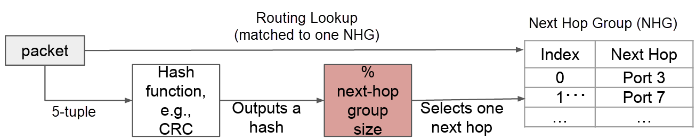

As illustrated in the diagram below, ECMP distributes traffic on a per-flow basis. Each colored square represents an individual packet, with each distinct color representing a unique flow. When these packets arrive at the router, the ASIC extracts the 5-tuple and runs the hash. Because this router has three available paths (a next-hop group of size three), the hash output is calculated modulo 3, sorting the flows into three distinct buckets:

- Pink Flow: Yields a specific hash remainder and is pinned to the top path.
- Blue Flow: Yields a different hash remainder and is pinned to the middle path.
- Orange & Green Flows: Yield the exact same hash remainder and are routed across the bottom path.

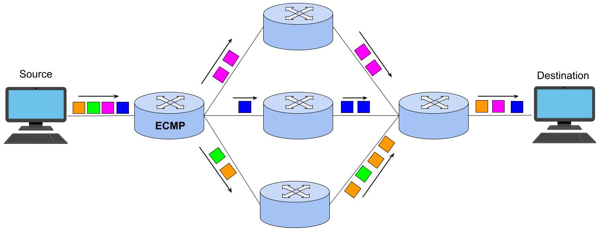

The Orange and Green flows demonstrate a standard hash collision. Because there are nearly infinite flow combinations but only a few physical links, different flows will inevitably compute to the same remainder and share a physical link.

> **Note:** ECMP hashing does not track how many packets or how much bandwidth has been sent to each next hop. It provides no guarantee that traffic is evenly distributed across all links. Distribution is purely statistical — it depends on the number and size of active flows and how their headers happen to hash. With a large number of **mice flows**, distribution tends to be even. With a small number of **elephant flows** or flows with similar headers, significant imbalance is possible. See [The Elephant Flow Problem](#the-elephant-flow-problem) for a detailed analysis.

### Advanced Configuration: Customizing the Hash

While the standard 5-tuple works for most traffic, modern network ASICs allow operators to customize which header fields are included in the hash calculation. On some platforms, the ASIC hashes additional fields by default beyond the 5-tuple, including **Source MAC**, **Destination MAC**, **Ethertype**, **VLAN ID**, and **Ingress Interface**. These extra fields improve distribution for non-IP traffic and provide additional entropy.

Operators can enable or disable individual fields to solve specific network challenges:

- **Encapsulated Traffic (Tunnels)**: For traffic wrapped in tunnels (like GRE or IPsec), hashing only the outer IP headers would map all tunneled traffic to a single link. Configuring the switch to include inner headers (inner source/destination IP, inner ports, inner protocol) in the hash prevents congestion by distributing the underlying flows across multiple links.

- **Fragmented Packets**: Fragmented IP packets often lack Layer 4 port information after the first fragment. If ports are included in the hash, subsequent fragments might take a different path than the first, leading to reassembly failures. Reconfiguring the hash to a 2-tuple (Source & Destination IP only) ensures consistent routing for all fragments.

- **IPv6 Flow Labels**: In IPv6 networks, the IPv6 Flow Label can be added to the hash. This provides the switch with high-quality randomness (entropy) without forcing the ASIC to parse deep into Layer 4 headers.

> **Note: Symmetric Hashing**
> By default on some platforms, **symmetric hashing** is enabled. This ensures that traffic flowing in both directions of a conversation (A→B and B→A) always hashes to the same physical path. The ASIC achieves this by treating source and destination fields as an unordered pair — swapping source IP with destination IP (and source port with destination port) produces the same hash output. Symmetric hashing is important for stateful monitoring tools (like NetFlow collectors or TAP aggregators) that need to see both sides of a flow on the same link. If the source and destination IP hash settings or the source and destination port hash settings are mismatched (one enabled, the other disabled), symmetric hashing is automatically disabled.

### ECMP in Leaf-Spine Topology

In a standard 2-tier fabric, the leaf switch is the primary device performing ECMP, choosing which spine to send traffic to. The spine typically has exactly one direct link to each destination leaf, so it simply forwards the packet without needing to load-balance. However, in a larger 3-tier fabric (leaf → spine → super-spine), the spine ASICs will also perform ECMP when selecting which super-spine to traverse to reach a completely different pod.

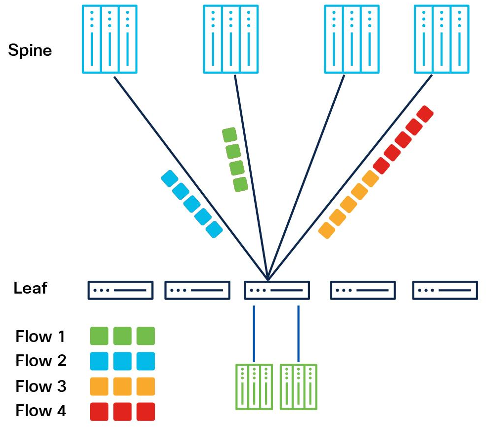

This asymmetry has a powerful scaling implication: adding a new spine switch to the fabric instantly adds one more ECMP bucket to *every* leaf in the fabric simultaneously. If a leaf previously had 4 spines (4 equal-cost paths), adding a 5th spine gives every leaf a 5th path, increasing total fabric bandwidth by 25% without touching a single existing switch configuration. This is one of the reasons Leaf-Spine scales predictably: bandwidth is a function of spine count, and ECMP distributes it automatically.

### The Multi-Hop Challenge: Hash Polarization

In a multi-tier topology, each switch independently computes its own ECMP hash on the same packet headers. If every switch uses the exact same hash algorithm and the same input fields, the same 5-tuple will produce the exact same hash result at every hop. The result is **hash polarization**: flows cluster onto the exact same physical paths across different tiers of the network, leaving some links heavily congested while parallel links sit completely idle.

#### Visualizing the Hash Polarization Problem

The following diagram illustrates hash polarization. Consider four flows (F1–F4), each with a different 5-tuple, arriving at Switch A:

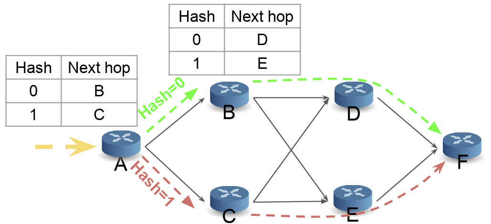

Switch A computes a hash on each flow's 5-tuple to select a next hop. According to the first hash table in the diagram, flows that hash to 0 are forwarded to Switch B (green dashed path) and flows that hash to 1 are forwarded to Switch C (red dashed path). Suppose F1 and F2 hash to 0, while F3 and F4 hash to 1. So far, the traffic is successfully split.

- F1 → hash 0 → Switch B
- F2 → hash 0 → Switch B
- F3 → hash 1 → Switch C
- F4 → hash 1 → Switch C

The polarization problem occurs at the second tier. Switch B receives F1 and F2 — the flows that produced hash 0 at Switch A. Because Switch B uses the exact same algorithm on the exact same 5-tuples, it computes the exact same hash values: F1 → 0, F2 → 0. Because every flow at Switch B hashes to 0, Switch B forwards 100% of its traffic to Switch D. The link from B to E sits completely idle.

- F1 → hash 0 again → Switch D
- F2 → hash 0 again → Switch D

The same occurs at Switch C. F3 and F4 both produced hash 1 at Switch A, and Switch C recalculates hash 1 for both. All traffic goes to Switch E. The link from C to D is never used.

Even though 4 equal-cost paths exist between A and F, the identical computation at each hop forces all traffic onto just 2 of them (A → B → D → F and A → C → E → F). The other two cross-links are wasted. Breaking this correlation requires each switch to produce a statistically independent hash result for the same 5-tuple. To achieve this, ASICs use Hash Seeds, Hash Offsets, and specific Hash Algorithms.

#### Hash Seed

The hash seed is a 32-bit integer (0–4,294,967,295) that is mixed into the hash computation before the algorithm processes the packet's 5-tuple fields. It is analogous to a cryptographic salt: feeding the same packet header into the same algorithm, but with a different seed, produces a completely different hash output and therefore a different ECMP member selection.

Assigning a unique seed per switch is the primary method for preventing hash polarization. With different seeds, the same packet produces a unique hash at each tier, ensuring flows are statistically distributed across the entire fabric.

#### Hash Offset

The hash offset dictates which bits of the computed hash value are actually used for the ECMP member selection. After a deterministic hash algorithm (like CRC or XOR) produces a multi-bit result, the ASIC extracts a specific window of bits starting at position offset to determine the final bucket index.

Even with unique seeds, the same algorithm processing the same 5-tuple can sometimes produce correlated bit patterns across tiers. The offset breaks this subtle correlation by forcing each tier to look at a completely different region of the hash output.

> **Note: Offset vs. Seed**
> Both mechanisms prevent hash polarization, but they work differently. The seed changes the hash computation itself (different input → different output). The offset keeps the hash output the same but extracts different bits for the bucket selection. Using both together provides the strongest anti-polarization across fabric tiers. (The offset has no effect on random or round-robin algorithms, as those do not compute a hash from packet headers).

### Hash Algorithms

The hash algorithm determines how the selected header fields and the seed are mathematically combined into the final hash value.

| Algorithm   | Description                                                                                                                                                                                                                                                                        |
| ----------- | ---------------------------------------------------------------------------------------------------------------------------------------------------------------------------------------------------------------------------------------------------------------------------------- |
| crc         | Standard CRC—the default and most widely used. Provides good distribution across buckets for typical traffic patterns.                                                                                                                                                             |
| crc-ccitt   | CRC-CCITT variant (polynomial 0x1021). Features slightly different bit-mixing than standard CRC; useful when the default CRC produces uneven distribution for a specific, highly predictable traffic profile.                                                                      |
| crc-32lo    | Uses the lower 32 bits of a CRC-32 computation. On platforms with wide hash pipelines, this selects the lower half.                                                                                                                                                                |
| crc-32hi    | Uses the upper 32 bits of a CRC-32 computation. Paired with crc-32lo, these two variants allow a network operator to use different halves of the same CRC calculation for ECMP vs. LAG. This avoids polarization between routing and switching without needing to change the seed. |
| xor         | Bitwise XOR of the hash fields. It is simpler and faster than CRC but produces weaker distribution. Fields that are numerically close (e.g., sequential IP addresses) tend to map to adjacent buckets.                                                                             |
| crc-xor     | Hybrid: A CRC calculation followed by an XOR fold. Combines CRC's distribution strength with XOR's ability to compress the result into fewer bits.                                                                                                                                 |
| random      | Ignores packet headers entirely and selects a bucket at random. Every packet is independently assigned, providing perfect statistical balance but zero flow affinity—packets from the same flow will likely take different paths, causing out-of-order delivery.                   |
| round-robin | Cycles through buckets sequentially (bucket 0, 1, 2, …, wrap). Like random, this provides no flow affinity and will cause significant packet reordering within flows.                                                                                                              |

Deployment Recommendations:

- Use `crc` for most deployments to ensure good distribution and flow path consistency.
- Mix `crc-32lo` and `crc-32hi` across ECMP/LAG with unique seeds for advanced anti-polarization.
- Avoid `random` and `round-robin` unless the application specifically tolerates packet reordering.

### The Disruption Problem

In static ECMP, the number of buckets exactly equals the number of active next-hops, and each next-hop owns exactly one bucket.

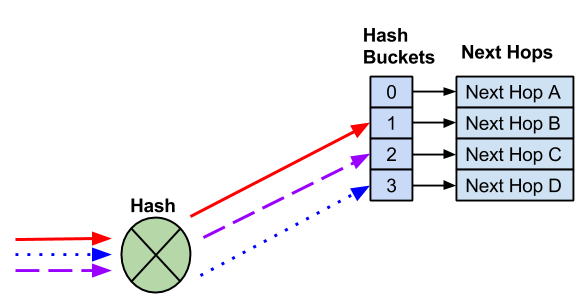

This means any membership change forces a complete rebuild of the hash-to-bucket mapping.

**Addition**: When a new next-hop is added (e.g., Server E joins), the bucket count increases and the hash modulus changes. The ASIC recalculates the mapping for all flows, not just the ones that will use the new path. Flows that were stable on their existing paths get reassigned to different next-hops, causing out-of-order packets.

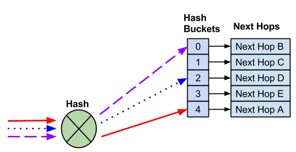

**Removal**: The same reshuffling occurs when a next-hop fails or is withdrawn. For example, when Server B fails, its bucket is removed and the total shrinks from four to three. The hash recalculation disrupts all remaining flows including those that had no relationship to Server B.

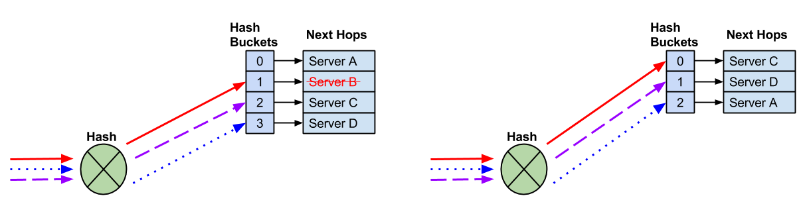

#### The Partial Fix — Consistent Hashing

To fix the reshuffling caused by static ECMP, engineers introduced Consistent Hashing. Consistent hashing decouples the number of buckets from the number of next-hops by creating a fixed-size container. Instead of having exactly 4 buckets for 4 servers, the switch might be configured with a fixed pool of 12 buckets, which are dealt out evenly (e.g., 3 buckets per server).

When an ECMP member fails or is removed, the number of hash buckets does not shrink. Instead, the specific buckets that belonged to the dead member are redistributed to the surviving next-hops.

- Advantage: All other flows remain completely undisturbed.
- Drawback: It does not prevent disruption when a new next-hop is added, as space must be cleared for the new member.

The following figure shows next-hops assigned in a round-robin fashion to a fixed, larger pool of buckets.

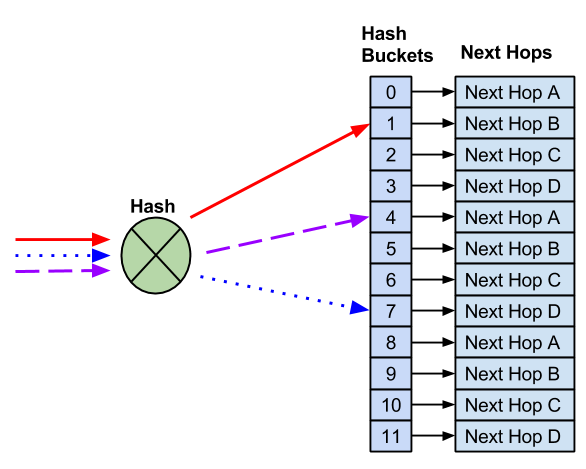

Because the number of buckets is fixed, removing a next-hop no longer changes the math for the entire group. When Next-Hop B fails, the total number of buckets (12) does not change.

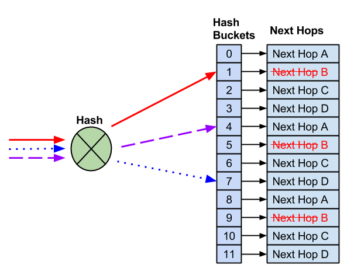

The system only takes the specific buckets mapped to the failed node and redistributes them to surviving next-hops. Healthy flows remain completely undisturbed.

#### The Complete Solution — Resilient Hashing

Consistent Hashing eliminates disruption on member removal (surviving flows are undisturbed), but it does not handle member additions gracefully. Because the bucket count is fixed, adding a new next-hop means stealing buckets from existing next-hops to give to the new one, which can still disrupt active flows. The following figures show adding Next-Hop E requires shifting some existing buckets (3 and 8) to make room, which can disrupt active sessions.

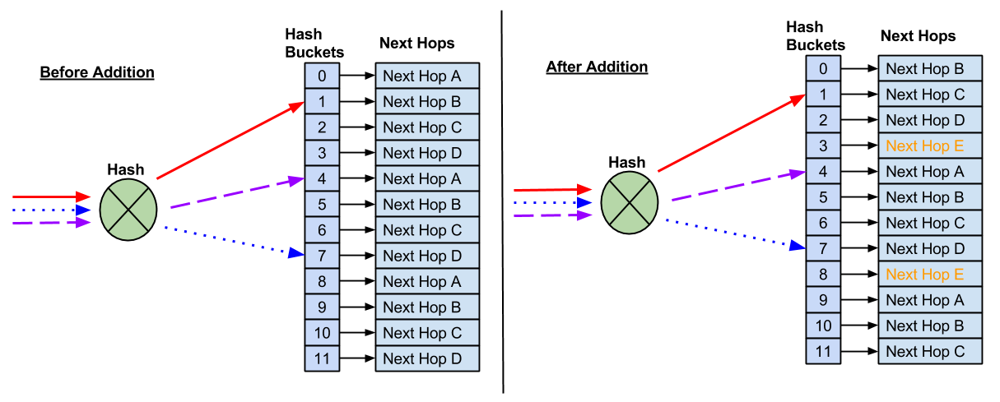

Resilient Hashing builds directly upon Consistent Hashing to solve the final puzzle piece: how to add a new server gracefully without breaking active sessions. It uses the same fixed-size bucket pool, but instead of immediately stealing buckets when a new node is added, it introduces patience. The core idea is:

1. The new next-hop is brought online but initially receives **zero buckets**.
2. The switch monitors which existing buckets are currently carrying active traffic and which are idle.
3. When a bucket goes idle (no recent traffic detected), the switch safely migrates that empty bucket to the new next-hop.
4. Active sessions are protected and allowed to naturally conclude on their original paths, while new traffic gradually begins balancing onto the new node.

This concept is universal to resilient hashing, but the specific implementation differs by ASIC vendor:

##### Broadcom (Immediate Redistribution)

On Broadcom ASICs (Tomahawk, Trident series), resilient hashing operates without timers or background monitoring:
- When a next-hop is **removed**, its buckets are immediately redistributed to the surviving next-hops.
- When a next-hop is **added**, some buckets are immediately migrated from existing next-hops to the new one.
- The algorithm balances buckets as evenly as possible across all next-hops. Assignment does not change for any reason other than membership changes (it does not react to traffic load or bucket activity).

This is simple and deterministic, but the immediate migration on addition can disrupt active flows that happen to occupy the stolen buckets.

##### Nvidia / Mellanox Spectrum (Timer-based, Gradual)

On Nvidia Spectrum ASICs, a background thread manages bucket migration using two configurable timers:
- `active_flow_timer`: Defines how long a bucket must be continuously idle (no traffic) before it is considered safe to migrate. The default is typically 120 seconds.
- `max_unbalanced_timer`: A hard ceiling on how long the system is allowed to remain unbalanced. If this timer expires and there are still not enough idle buckets, the switch forces a migration as a safety net.

The step-by-step process:
1. A new next-hop is added. It receives zero buckets.
2. The background thread continuously scans all buckets for activity.
3. When a bucket has been idle for the full `active_flow_timer` duration, it is migrated to the new next-hop.
4. If the `max_unbalanced_timer` expires before enough idle buckets are found, the thread forces a rebalance (which may disrupt active sessions).

This timer-based approach protects long-lived sessions from disruption during scale-out events, at the cost of temporarily uneven distribution until buckets naturally become idle. In networks with highly persistent flows, the new next-hop may remain underutilized for an extended period.

##### Bucket Count Trade-offs

Resilient hashing uses a finite, hardware-level pool of buckets that is shared across all ECMP groups on the switch. The number of buckets per ECMP group is configurable (common options: 64, 128, 256, 512, or 1024), and this choice represents a direct trade-off:

- **More buckets per group:** Reduces the disruption impact when a next-hop is added or removed (a smaller percentage of flows are affected). However, the total number of ECMP groups the switch can support decreases because the shared hardware pool is consumed faster.

- **Fewer buckets per group:** Supports more ECMP groups simultaneously, but each add/remove event disrupts a larger proportion of flows.

If the maximum number of ECMP groups is reached, new ECMP routes cannot be installed and are rejected by the hardware.

## The Elephant Flow Problem

ECMP was designed around the "law of large numbers." It assumes that hashing thousands of random, small flows (Mice) will naturally and evenly distribute traffic across all available links. For Mice flows, this statistical assumption works perfectly. However, because ECMP is strictly bound by the rule that it cannot split a single flow across multiple paths (to preserve packet ordering), an entire Elephant flow is forced to traverse a single physical link.

When an Elephant flow enters the fabric, it exposes the rigidity of hardware-based hashing. Because the underlying ASIC hash function is static (meaning the same 5-tuple will always produce the exact same physical port assignment) it cannot dynamically react to bandwidth utilization. This leads to a highly inefficient scenario:

- A massive Elephant flow hashes to a specific spine link, instantly consuming a huge portion of that link's total capacity.

- If a second Elephant flow enters the switch and happens to compute to the exact same hash remainder (a **hash collision**), the ASIC blindly assigns it to that same already-burdened link.

- The link quickly hits 100% saturation and begins dropping packets.

While that single link is completely overwhelmed and dropping traffic, neighboring parallel spine links connected to the exact same destination might be sitting completely idle. Because standard ECMP is completely unaware of link utilization or flow size, it will happily forward an Elephant flow into a congested bottleneck while ignoring perfectly good, unused bandwidth right next door.

### ECMP Congestion in Practice

Consider the diagram below, which contrasts an ideal uncongested fabric with a congested one suffering from a hash collision.

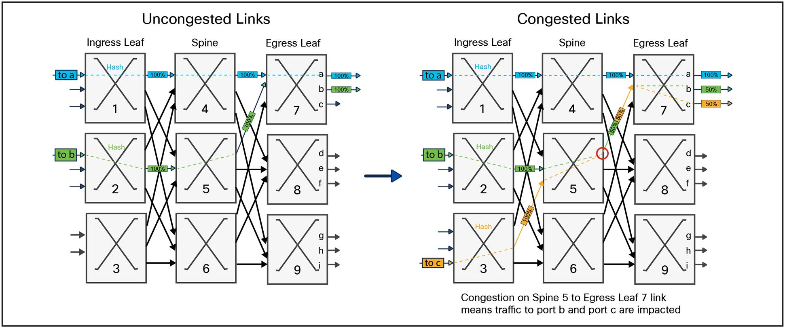

The left side of the diagram illustrates ECMP working perfectly. A Blue flow (destined for port a) enters Ingress Leaf 1, hashes to Spine 4, and travels down to Egress Leaf 7. A Green flow (destined for port b) enters Ingress Leaf 2, hashes to Spine 5, and travels down to the same Egress Leaf 7. Because the ASIC's hash function mathematically assigned them to different spines, they each traverse dedicated physical links. Both flows operate at 100% capacity without interfering with one another.

The right side of the diagram illustrates the Elephant Flow problem in action when a new Orange flow (destined for port c) enters the network at Ingress Leaf 3. Leaf 3 uses its static ECMP hash to determine the path for the Orange flow. The math happens to yield the exact same remainder as the Green flow, dictating that the Orange flow must also be sent to Spine 5. Now, Spine 5 is forced to forward both the Green and Orange flows down to Egress Leaf 7 across a single physical link.

Because these are massive Elephant flows, they demand more bandwidth than the single link can provide. They congest the link, forcing the switch to drop packets and effectively cutting the throughput of both flows down to 50% capacity. (If these were small Mice flows, they would share the link without noticeable degradation).

This scenario highlights the blind spot of ECMP. Notice that Spine 6 has a completely unobstructed, 100% idle path to Egress Leaf 7. However, because standard ECMP cannot monitor link utilization or dynamically reroute traffic mid-flow, it forces the Orange flow into a bottleneck while parallel bandwidth goes completely unused.

### Hash Collisions Are Statistically Inevitable

ECMP distributes flows based on hash values, not bandwidth. It has no awareness of how much traffic each flow carries. When two elephant flows independently hash to the same spine link, they compete for the same bandwidth: one link is saturated while parallel links sit idle. With mice flows, this rarely matters because each flow is tiny. With elephant flows, a single collision can halve the throughput of both flows.

#### The Birthday Paradox

The probability of hash collisions follows the same mathematics as the [birthday paradox](https://en.wikipedia.org/wiki/Birthday_problem). For *N* flows across *K* equal-cost paths, the probability of at least one collision is:

    P(collision) = 1 − K! / (K^N × (K−N)!)    when N ≤ K
                 = 1.0                        when N > K

With just *K* + 1 flows, collisions are guaranteed. But they become overwhelmingly likely long before that. With *K* = 8 spine links, the probability exceeds 50% at only 4 flows and reaches near certainty well before 8.

#### Performance Impact

Collisions cause *uneven* load, not just duplicate assignments. The expected number of flows on the most congested path is:

    Expected max load = (N/K) × (1 + ln(K) / ln(N/K))

For a leaf switch with *K* = 8 spine uplinks and *N* = 32 active elephant flows:

    Fair share     = N/K = 32/8 = 4 flows per path
    Expected max   = 4 × (1 + ln(8)/ln(4)) = 4 × (1 + 1.5) = 10 flows

The most congested spine link is expected to carry **10 flows** (2.5× its fair share) while lightly loaded links sit underutilized. This imbalance costs the fabric approximately 10–15% in total throughput, even though aggregate capacity is more than sufficient.

## Weighted ECMP

We assumed so far that all paths in an ECMP group are **equal** — same link speed, same capacity, same share of the hash space. **Weighted ECMP** removes this assumption by allowing each next hop to receive a **proportional** share of traffic based on an assigned weight.

> The industry has not settled on a single name. Cumulus Linux (Nvidia) and Nokia use **Weighted ECMP**; SONiC, Google, and SAI use **WCMP** (Weighted Cost Multipath); Cisco and Juniper use **UCMP** (Unequal Cost Multipath). **BGP Link Bandwidth** is the BGP extended community that signals per-path capacity to derive weights. The underlying mechanism is the same in all cases.

### Why It Is Needed

Consider a fabric with **heterogeneous link speeds** — for example, during a rolling upgrade from 40G to 100G. If a leaf has one 100G uplink to Spine A and one 40G uplink to Spine B, standard ECMP splits flows 50/50. The 40G link saturates while the 100G link sits underutilized. Weighted ECMP allows the operator to assign weights (e.g., 5:2) that match the capacity ratio, steering approximately 71% of flows toward the faster link. It is also used for **traffic engineering** — deliberately directing more traffic toward a specific path, even when link speeds are identical.

### How Weights Are Implemented in Hardware

Weighted ECMP uses the same hash-and-bucket mechanism as standard ECMP. The only difference is how buckets are allocated. In standard ECMP with 3 next hops and 12 buckets, each next hop owns exactly 4. In weighted ECMP, a next hop with higher weight owns **more buckets**.

The most common hardware technique is **entry replication**: the same physical next hop is listed multiple times in the next-hop group. The hash function is unchanged (it still maps flows to buckets uniformly) but because a heavier next hop occupies more buckets, it statistically receives more flows:

    Standard ECMP (equal):           [A] [B] [C] [A] [B] [C] [A] [B] [C]
    Weighted ECMP (3:1:1 weight):    [A] [A] [A] [B] [C] [A] [A] [A] [B] [C]

### Limitations

Weighted ECMP inherits the same fundamental constraint as standard ECMP: each flow is pinned to a single bucket and **cannot be split**. The configured weight ratio only holds statistically when there are many small mice flows. A small number of elephant flows can easily skew the actual load far from the intended weights.

Additionally, weighted ECMP complicates [resilient hashing](#the-complete-solution--resilient-hashing). When a next-hop group is resized, redistributing replicated entries can inadvertently alter the intended weight ratio — a problem known as **weight skew**.

## Centralized Traffic Engineering (The SDN Approach)

### The Fundamental Limitation of ECMP

Every mechanism discussed in this document — hash tuning, polarization mitigation, resilient hashing, weighted ECMP — improves ECMP but cannot escape its core constraint: **the switch makes forwarding decisions using only local information**. Each switch hashes packet headers and selects a bucket independently, with no knowledge of how much traffic other switches are placing on the same links. When multiple leaf switches independently hash elephant flows onto the same spine link, the result is congestion on that link while parallel links sit idle — and no individual switch can detect or correct this because each one sees only its own egress ports.

This is not a configuration problem. It is an architectural limitation of any system where forwarding decisions are made independently at each hop using only locally available information.

### Centralized Traffic Engineering

An entirely different approach is to remove per-switch decision-making and hand it to a **central controller** that has a global view of the entire fabric. This is the SDN (Software-Defined Networking) approach to traffic engineering, where the controller collects real-time demand information from every switch, computes globally optimal flow placement, and programs the forwarding tables accordingly.

**MicroTE** is the foundational example of this approach (["MicroTE: Fine Grained Traffic Engineering for Data Centers,"](https://dl.acm.org/doi/abs/10.1145/2079296.2079304) ACM CoNEXT, 2011). The key insight is that data center traffic, while appearing random in aggregate, contains a significant fraction of large, predictable flows that persist long enough for a centralized system to detect and optimize.

MicroTE operates in three phases:

1. **Demand Collection:** ToR switches periodically report their current traffic matrix to the central controller — which source is sending how much traffic to which destination. This telemetry runs on timescales of a few seconds.

2. **Global Computation:** The controller, armed with a complete view of every flow and every link in the fabric, computes an optimal routing plan. It can simultaneously place TOR 1's elephant flow on Spine 1 and TOR 2's elephant flow on Spine 2, achieving a globally balanced solution that no independent hash function could guarantee.

3. **Route Programming:** The controller pushes the computed routes back into the switches' forwarding tables, overriding the default ECMP hash for the targeted flows.

MicroTE focuses its optimization on the **predictable** portion of traffic (large, stable [elephant flows](#the-elephant-flow-problem)). Short-lived [mice flows](#what-is-a-network-flow) change too rapidly for a centralized system to track, so they are left to standard ECMP, where their small size means hash collisions cause negligible harm.

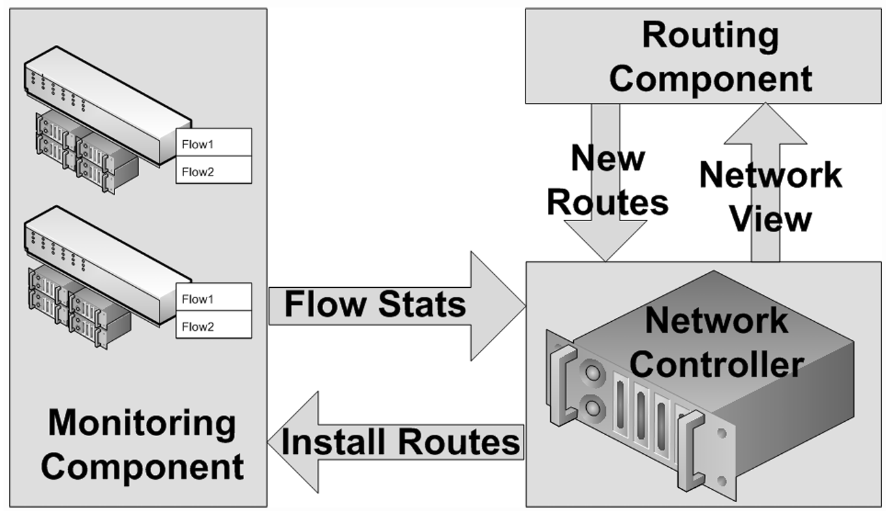

### ECMP vs. Centralized TE

| Dimension                    | ECMP (Distributed Hash-Based)                                                             | Centralized TE (MicroTE / SDN)                                                              |
|:-----------------------------|:------------------------------------------------------------------------------------------|:---------------------------------------------------------------------------------------------|
| **Architecture**             | Fully distributed — each switch independently hashes and forwards                         | Centralized — a controller collects demand, computes routes, and programs switches            |
| **Congestion Visibility**    | None — the hash function has no awareness of link utilization                              | Complete — the controller sees every flow and every link in the entire fabric simultaneously  |
| **Reaction Speed**           | Instantaneous — hash lookup is performed in hardware at line rate                          | Seconds (collect telemetry → compute routes → push to switches)                               |
| **Decision Quality**         | Statistical — distribution depends on flow count and header entropy, not actual demand     | Globally optimal — the controller can coordinate all switches simultaneously                  |
| **Elephant Flow Handling**   | Blind — elephant flows are pinned by hash with no regard for link load                     | Explicitly detects and places elephant flows on optimal paths                                 |
| **Microburst Handling**      | No reaction — hash assignments are static regardless of transient load                     | Poor — microbursts appear and vanish before the controller can react                          |
| **Hardware Requirement**     | Standard ECMP support (universal in modern ASICs)                                          | Standard switches with programmable forwarding tables; no special ASIC features required     |
| **Infrastructure Overhead**  | None — runs entirely within existing switch hardware                                       | Requires an external controller, telemetry pipeline, and high-availability design             |
| **Failure Mode**             | Always available — hash-based forwarding requires no external dependencies                 | Controller is a single point of failure — if it goes down, switches fall back to static ECMP  |

### Industry Adoption

In practice, centralized TE and distributed ECMP are not competing alternatives — they are complementary layers deployed together:

- **ECMP everywhere (universal):** Every modern data center fabric uses ECMP as the baseline forwarding mechanism. It handles the vast majority of traffic (mice flows) effectively with zero infrastructure overhead.

- **Centralized TE on top (hyperscale operators):** Google, Microsoft, and Meta layer centralized SDN controllers over their ECMP fabrics to optimize elephant flow placement. [Google's Jupiter and B4 networks](http://static.googleusercontent.com/media/research.google.com/en//pubs/archive/43837.pdf), Microsoft's SWAN, and Meta's fabric all use centralized controllers to compute traffic-engineered paths. These operators have the engineering resources to build and maintain the controller infrastructure, telemetry pipelines, and high-availability systems that centralized TE demands.

- **Smaller operators:** Most enterprise and mid-scale data centers rely on ECMP alone (with hash tuning and resilient hashing) and accept the statistical imperfections. The engineering cost of building and operating a centralized TE system outweighs the throughput gains for fabrics below hyperscale.

> For an alternative approach to ECMP's congestion blindness — one that keeps decision-making distributed but makes each switch **congestion-aware** in real time — see [Adaptive Routing](./02b_README_ARS.md).
