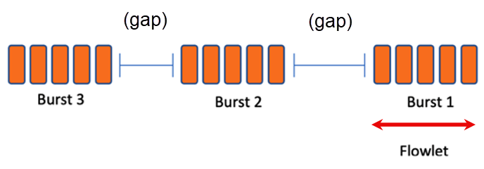
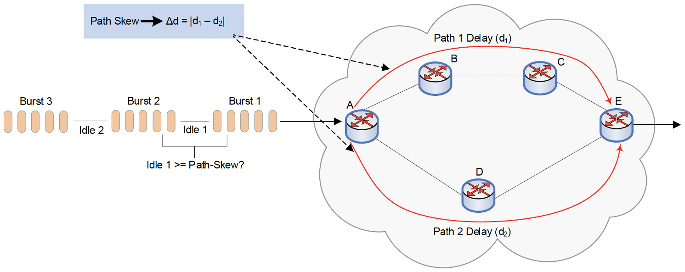
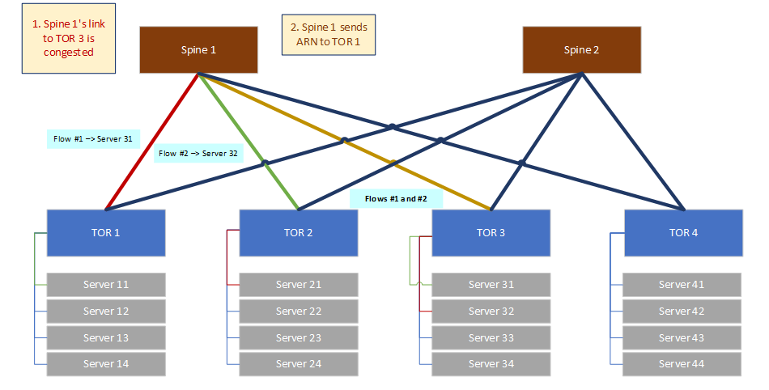
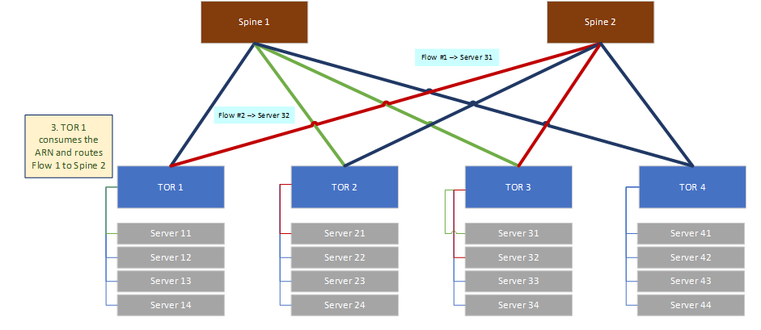

# Adaptive Routing (AR)

ECMP routing is the traditional method for distributing traffic across multiple paths in a data center fabric. It works well for baseline traffic because it requires no state tracking and naturally prevents packets from arriving out of order.

However, ECMP relies entirely on a static hash of packet headers to assign a flow to a path. This introduces a critical flaw: ECMP is blind to network congestion. Once a flow is mapped to a path, it stays on that path. If a sudden influx of heavy data (an "elephant flow") saturates a link, ECMP will continue sending traffic into the congested port, leading to packet drops, while parallel links might remain completely empty.

To fix ECMP's congestion blindness, **Adaptive Routing** was introduced. Rather than relying on a permanent mathematical hash, an adaptive switch actively monitors the physical state of the network. By continuously measuring congestion signals on its egress ports, the switch can dynamically steer new traffic away from overloaded links and toward available ones.

> **Terminology:**
> The industry has not settled on a single name for this class of technology. Broadcom calls it **Dynamic Load Balancing (DLB)**, Marvell uses the same term under their Teralynx architecture, while Nvidia/Mellanox popularized the term **Adaptive Routing (AR)** across their Spectrum Ethernet ASICs and InfiniBand networks. The [SAI](https://github.com/opencomputeproject/SAI) (Switch Abstraction Interface) specification also adopts the term Adaptive Routing. Despite the different labels, the underlying principle is the same: the switch monitors real-time congestion and dynamically steers traffic away from overloaded links. This document uses "Adaptive Routing" as the general term.


## Measuring Congestion

To make intelligent rerouting decisions, the switch must first reliably measure congestion. It does this by evaluating the egress packet buffer (measured in cells or bytes). When traffic hits a port faster than the switch can transmit it, the packets queue up. High buffer occupancy directly equals high congestion. From here, the switch uses a two-phase decision process:

- Port Grading (answering if it should reroute)
- Quality Scoring (answering where it should reroute)


### Port Grading

Port Grading assigns a congestion classification to each egress port based on its **instantaneous** raw buffer occupancy. In high-performance fabrics reacting to instantaneous buffer states is paramount to preventing immediate packet drops. The switch reads the raw buffer occupancy of each port and maps it to operator-configurable thresholds, assigning a discrete grade:

| Buffer Occupancy              | Grade | Meaning              |
|:------------------------------|:-----:|:---------------------|
| Below threshold 1 (low)       | 0–1   | Idle or very light   |
| Between threshold 1 and 2     | 2     | Moderate             |
| Between threshold 2 and 3     | 3     | Heavy                |
| Above threshold 3 (high)      | 4     | Critical / near drop |

These grades are then grouped into a binary classification:

- **Free**: The port is below the "busy" threshold (e.g., Grades 0-3). It is healthy.
- **Busy**: The port has hit the "busy" threshold (e.g., Grade 4). It is congested.

Every port continuously carries a Grade and a Free/Busy label. These labels are consumed by the reroute decision logic described below.


### Quality Scores

Quality Scoring assigns a **smoothed** congestion ranking to each egress port, representing its sustained load over time rather than an instantaneous snapshot.

Raw buffer data cannot be used for ranking because network traffic is incredibly bursty. A single microburst of packets arriving at the exact millisecond the switch checks the buffer would make a healthy port look congested. If the switch reacted to every micro-spike, traffic would wildly bounce back and forth between links — a destructive loop known as **thrashing**.

To solve the noise problem, the switch smooths out the buffer readings using the **EWMA** (Exponentially Weighted Moving Average) algorithm. EWMA takes a continuous sample of the buffer and mathematically blends it with the historical load, creating a stable estimate of true congestion. The formula is defined as:

$$Load_{new} = \alpha \times Sample_{current} + (1 - \alpha) \times Load_{previous}$$

Where:

- $Sample_{current}$: The raw, noisy measurement taken right now.
- $Load_{previous}$: The smoothed historical estimate.
- $\alpha$ (alpha): The tuning knob for responsiveness.

In ASIC hardware, multiplication is computationally expensive, so $\alpha$ is typically implemented using bit-shifting operations represented as powers of two ($1/2^n$). For example:

| Exponent (n) | α      | Behavior                         |
|:------------:|:------:|:---------------------------------|
| 1            | 0.5    | Very responsive, less smoothing  |
| 2            | 0.25   | Moderate (common default)        |
| 4            | 0.0625 | Heavily smoothed, slow to react  |

The choice of $\alpha$ represents a direct trade-off between responsiveness and stability:

- **High $\alpha$** (e.g., 0.5): The equation heavily favors the $Sample_{current}$. The switch reacts quickly to new data but is highly susceptible to thrashing from noise.

- **Low $\alpha$** (e.g., 0.0625): The equation heavily favors the $Load_{previous}$. The switch produces a smooth, stable reading but is slow to react to genuine, sudden congestion.

The resulting smoothed value is translated into a numerical **Quality Score** per port. A lower score indicates less sustained congestion. Like Grades, these scores are continuously maintained and consumed by the reroute decision logic.

Why EWMA Suits Adaptive Routing:

- **Low cost:** One multiply-accumulate per port per sampling interval — trivially implementable in hardware.
- **Tunable trade-off:** A single parameter (the exponent) lets operators balance responsiveness against stability.
- **Bounded memory:** Only one state value per port (the running average).


## Adaptive Routing Algorithms

The previous sections established *how* the switch measures congestion (Port Grading for instantaneous detection, Quality Scoring for smoothed ranking). What remains is *when* and *at what granularity* the switch applies these measurements to make forwarding decisions. This is where the choice of algorithm matters. The two primary modes (Flowlet and Packet-Spray) represent fundamentally different trade-offs between preserving packet order and maximizing link utilization.


### Flowlet Mode

#### Why Not Just Distribute Packets?

Historically, the industry standard has been ECMP routing, which uses a mathematical hash of the packet headers to pin an entire flow to a single output interface. While computationally simple, this approach is blind to actual traffic volume. Multiple elephant flows can hash to the same link, causing severe congestion and packet drops while parallel links sit entirely idle.

The logical solution is to break the flow apart by distributing individual packets across all available output interfaces. However, this introduces a critical challenge: the **packet reordering constraint**.

#### The Packet Reordering Constraint

If we distribute a flow's packets across multiple links, those packets will experience different path latencies. A packet sent later on a fast path will arrive before a packet sent earlier on a slow path. This creates a serious problem for the protocols running on the receiving server.

**TCP** guarantees ordered delivery to the application. When packets arrive out of sequence, the receiver must buffer the early arrivals and wait for the missing ones to fill the gaps. While buffering, TCP interprets the disorder as a sign of packet loss — it sends duplicate ACKs back to the sender, which triggers unnecessary retransmissions that waste bandwidth and reduce throughput.

**RoCE** (RDMA over Converged Ethernet) is more sensitive. Traditional NICs lack the hardware capability to buffer and reorder large volumes of out-of-order data at line rate. In standard RoCE Reliable Connection (RC) mode, a single misordered packet can trigger a "go-back-N" retransmission of the entire outstanding send queue, effectively stalling the transfer.

> RDMA and RoCE are covered in detail in the [RDMA Primer](https://github.com/ManiAm/RDMA-Primer).

#### What Is a Flowlet?

To balance the need to avoid reordering and the need to maximize link utilization, researchers introduced the concept of the **Flowlet**. Flowlet Switching was first proposed by [S. Kandula et al., *"Dynamic Load Balancing Without Packet Reordering,"* ACM SIGCOMM CCR, 2007](https://dl.acm.org/doi/10.1145/1232919.1232925).

> A flowlet is a burst of packets within a larger flow, separated from the next burst by a brief gap of silence (idle time).



If a flow has been idle long enough that all previously sent packets have successfully reached their destination, there are no packets left "in flight" on the old path. At this point, it is safe to switch the flow to a different path. There is nothing left to arrive out of order.

#### The Critical Parameter: Idle Time

How long does a gap need to be before the switch considers it safe to move the flow? This is defined by the **idle time** (or flowlet gap) parameter. Getting this parameter right is crucial:

- **Too short**: If the switch reroutes too quickly, packets from the previous flowlet might still be traveling on the old path. Rerouting creates the reordering we are trying to avoid.

- **Too long**: If the switch waits too long to recognize a gap, it rarely gets the opportunity to move traffic, reducing the overall effectiveness of the adaptive routing algorithm.

The ideal idle time is based on **path skew** (the maximum difference in latency between any two paths). For example, if Path A takes 5 µs and Path B takes 8 µs, the skew is 3 µs. If you set your idle time to anything greater than 3 µs, you guarantee no reordering.



#### How the Algorithm Works (Step-by-Step)

The switch maintains a finite **flow table** in its hardware (SRAM) to track this. For every active flow, it records the currently assigned path and a timestamp of the last packet it processed. When a packet arrives, the switch executes the following logic at high speeds:

- **Is it a New Flow?** If the flow isn't in the table, the switch creates an entry, picks the least-congested free port, and sends the packet.

- **Is it Mid-Flowlet?** (Gap < Idle Time): If the time since the last packet is less than the configured idle time, the switch unconditionally forwards the packet out the same port as before. It ignores congestion grades. The priority here is preserving packet order within the burst. The timestamp is updated.

- **Is it a Flowlet Boundary?** (Gap ≥ Idle Time): If the time since the last packet is greater than the idle time, the switch recognizes a safe boundary. It now evaluates congestion. If the current port is still Free, the flow stays where it is. There is no reason to move it. If the current port is **Busy**, the ASIC scans for Free alternatives and uses the Quality Score to pick the best one via `random-from-best`.

> **What is `random-from-best`?**
> Rather than always selecting the single port with the lowest Quality Score, `random-from-best` first identifies all Free ports that share the best (lowest) Quality Score, then picks randomly among them. This prevents multiple flows from deterministically converging onto the exact same "best" port — which would simply move the congestion problem from one link to another.

Flowlet switching is highly conservative. Under zero congestion, it behaves exactly like traditional static routing, keeping flows pinned to their original paths. Reroutes only occur when both congestion is present AND a natural gap provides a safe window.

#### Hardware Constraints

Because flowlet algorithm requires remembering the state and timestamp of every active flow, it is limited by hardware memory. When the flow table is full, the switch must either evict an old entry (which risks reordering if that flow suddenly wakes up) or fall back to static routing for new flows. Therefore, the size of the flow table (`max_flows`) is a critical hardware resource.


### Packet-Spray Mode

While Flowlet switching is highly effective, it is fundamentally conservative: it relies on natural pauses in traffic to safely move flows. However, some high-performance workloads—particularly continuous high-bandwidth streams in storage and AI/ML training fabrics—produce massive "elephant flows" that never pause. For these continuous streams, Flowlet switching may never find a safe opportunity to reroute, leaving links heavily unbalanced. To address this, Packet-Spray takes a much more aggressive, stateless approach to load balancing.

#### The Concept of Packet Spraying

In Packet-Spray mode, every single packet is routed independently ([A. Dixit et al., *"On the Impact of Packet Spraying in Data Center Networks,"* IEEE INFOCOM, 2013](https://ieeexplore.ieee.org/document/6566872)). The switch completely abandons the concept of flow affinity. There is no per-flow state, no 5-tuple tracking, no flow table, and no idle timers. Because each packet independently seeks out the best path, a single massive elephant flow is instantly shattered and distributed across all available links.

- Packet 1 → Spine 3 (least congested)
- Packet 2 → Spine 1 (least congested now)
- Packet 3 → Spine 4 (least congested now)
- Packet 4 → Spine 2 (least congested now)

Packet spraying achieves near-perfect load distribution across all links. No single elephant flow can saturate one path — its packets are spread across all paths.

#### How the Algorithm Works (Step-by-Step)

In Packet-Spray mode, the congestion metrics (Grading and Quality Scoring) are consulted on every single packet at wire speed:

- **Evaluate Grade**: The ASIC evaluates the instantaneous Grade of all available ECMP member ports to isolate the set of "Free" candidates.

- **Evaluate Quality**: Among those Free candidates, the switch consults the Quality Score.

- **Select Port**: The switch uses `random-from-best` to choose the egress port.

#### The Reordering Requirement

As discussed in the [Packet Reordering Constraint](#the-packet-reordering-constraint), distributing a flow's packets across multiple paths causes out-of-order delivery. Flowlet switching avoids this entirely by only rerouting during idle gaps. Packet-Spray, by contrast, accepts reordering as inevitable and shifts the burden to the **receiving NIC**. Deploying Packet-Spray requires endpoint NICs with dedicated hardware reorder buffers capable of reassembling packets by sequence number at line rate. Without this capability, out-of-order packets would trigger retransmissions and cripple throughput. Modern high-performance NICs (such as NVIDIA ConnectX-7 and AMD Pollara) include this hardware natively.


### Comparing Flowlet vs. Packet Spray

Understanding when to deploy each algorithm comes down to the capabilities of your endpoints and the nature of your traffic.

| Feature / Dimension              | Flowlet Mode                                                                                                     | Packet-Spray Mode                                                                                |
| -------------------------------- | ---------------------------------------------------------------------------------------------------------------- | ------------------------------------------------------------------------------------------------ |
| Routing Granularity & Frequency  | Sub-flow (Flowlet): Reroute frequency depends entirely on natural traffic bursts and idle gaps.                  | Per-packet: Every single packet is an independent routing decision.                              |
| Switch State & Hardware Cost     | High State: Requires dedicated SRAM for a per-flow hardware table and timestamp tracking.                        | Stateless: Minimal hardware cost; requires no flow tables or timestamp logic.                    |
| Load Balancing & Elephant Flows  | Good: Effective, but massive elephant flows can get "stuck" if they lack natural idle gaps to trigger a reroute. | Near-Perfect: Extracts maximum utilization by immediately shattering and distributing all flows. |
| Failure Reaction Time            | Delayed: Switch must wait for the next flowlet boundary (gap) to move traffic off a degraded link.               | Immediate: The very next packet seamlessly routes around the failure or congestion.              |
| Configuration Complexity         | High: The `idle_time` parameter is critical and must be carefully tuned to the network's path skew.              | Low: Stateless nature requires minimal algorithmic tuning.                                       |
| Packet Ordering Risk             | None / Preserved: Safe from reordering, provided the `idle_time` is tuned correctly.                             | Guaranteed out-of-order: Packets within a flow will take different paths and arrive scrambled.   |
| Endpoint & Protocol Requirements | Universal: Works with any transport protocol and standard NICs.                                                  | Strict: Requires advanced endpoint hardware (NIC-based reorder buffers) to fix ordering.         |

**Deployment Strategy: When to Use Which**

- **Default to Flowlet**: Flowlet is the safe, universal default. It works gracefully with any transport protocol and requires no special hardware from the receiving servers. It is the best choice for mixed-traffic environments or traditional enterprise data centers.

- **Upgrade to Packet-Spray**: Packet-Spray is the optimal choice for purpose-built fabrics such as pure AI/ML training clusters or high-performance NVMe-over-Fabrics storage networks. In these environments, all endpoints utilize advanced transport protocols and feature hardware-reordering NICs, allowing the network to safely extract maximum throughput and near-perfect link utilization.


### Putting It All Together

The following diagram summarizes how all the components discussed above fit together inside the ASIC's forwarding pipeline:


```
┌─────────────────────────────────────────────────────────────────────┐
│                        Packet Arrives                               │
└──────────────────────────────┬──────────────────────────────────────┘
                               │
                               ▼
┌─────────────────────────────────────────────────────────────────────┐
│  1. Route Lookup                                                    │
│     → Multiple equal-cost next-hops found (ECMP group)              │
└──────────────────────────────┬──────────────────────────────────────┘
                               │
                               ▼
┌─────────────────────────────────────────────────────────────────────┐
│  2. Traffic Classification                                          │
│     Is this packet eligible for adaptive routing?                   │
│     (protocol, port, ACL)                                           │
│                                                                     │
│   NO → static ECMP hash. Done.                                      │
└──────────────────────────────┬──────────────────────────────────────┘
                               │ YES
                               │
                               │    ┌────────────────────────────────────────┐
                               │    │  3. Congestion Assessment              │
                               │    │     (independent background loop)      │
                               │    │                                        │
                               │    │  Continuously monitors all egress      │
                               │    │  ports and maintains:                  │
                               │    │   • Port Grades (Free / Busy)          │
                               │    │   • Quality Scores (EWMA ranking)      │
                               │    └───────────────────┬────────────────────┘
                               │                        │
                               ▼                        ▼
┌──────────────────────────────┬──────────────────────────────────────┐
│  4. Path Decision                                                   │
│                                                                     │
│  ┌─────────────────┐    ┌─────────────────┐                         │
│  │  FLOWLET MODE   │    │  PACKET SPRAY   │                         │
│  ├─────────────────┤    ├─────────────────┤                         │
│  │ Look up         │    │ Select port     │                         │
│  │ flow table      │    │ with best       │                         │
│  │                 │    │ quality score   │                         │
│  │ Gap ≥ idle?     │    │                 │                         │
│  │  Y: reroute     │    │ Forward         │                         │
│  │  N: keep        │    │ immediately     │                         │
│  └─────────────────┘    └─────────────────┘                         │
└──────────────────────────────┬──────────────────────────────────────┘
                               │
                               ▼
┌─────────────────────────────────────────────────────────────────────┐
│  5. Forward packet on selected egress port                          │
└─────────────────────────────────────────────────────────────────────┘
```


## Global Adaptive Routing

### The Limitation of Local Adaptive Routing

Everything discussed so far in this document has been **Local Adaptive Routing**. Each switch independently monitors the congestion on its own egress ports (using Port Grading and Quality Scores) and makes forwarding decisions based solely on what it can see locally. The switch has no knowledge of what is happening on downstream switches or on links further along the path.

This creates a critical blind spot. Consider a simple Leaf-Spine fabric:



In this scenario, Flow 1 (TOR 1 → TOR 3) and Flow 2 (TOR 2 → TOR 3) are both routed through Spine 1. The congestion builds up on the **downlink** between Spine 1 and TOR 3, because both flows are competing for the same egress port on Spine 1.

From Spine 1's perspective, local adaptive routing can detect this congestion on its own egress port toward TOR 3. However, Spine 1 cannot fix it — it has no alternative path to TOR 3 (in a standard 2-tier fabric, each spine has exactly one link to each leaf).

The real problem is upstream. TOR 1 and TOR 2 are the switches that *chose* to send traffic to Spine 1 in the first place. If TOR 1 knew that Spine 1's downlink to TOR 3 was congested, it could reroute Flow 1 to Spine 2 instead. But TOR 1 has no visibility into Spine 1's egress ports — its local adaptive routing only monitors its own uplinks to the spines, which may appear perfectly healthy.

### Adaptive Routing Notifications (ARN)

**Adaptive Routing Notifications (ARN)** solve this blind spot by enabling switches to propagate congestion information **backward** (upstream) through the network. When a switch detects congestion on an egress port that it cannot resolve locally, it generates an ARN and sends it to the upstream switch feeding the congested traffic, transforming routing from a purely local decision into a **network-wide** (global) one.

The ARN mechanism works as follows:

1. **Congestion Detection:** Spine 1 detects that its egress port toward TOR 3 is congested. It determines that it cannot resolve this locally because it has no alternative path to TOR 3.

2. **ARN Transmission:** Spine 1 generates an ARN packet and sends it **upstream** to the ingress switches (TOR 1 and TOR 2) that are sending traffic through this congested path. The ARN carries information identifying the congested port and its severity.

3. **Upstream Response:** TOR 1 receives the ARN from Spine 1. TOR 1 now knows that the path through Spine 1 to TOR 3 is congested — even though TOR 1's own uplink to Spine 1 appears healthy. TOR 1 incorporates this remote congestion data into its adaptive routing decision.

4. **Rerouting at the Source:** TOR 1 reroutes Flow 1 to use Spine 2 instead of Spine 1. TOR 1 is the switch with the actual power to fix the problem, because it is where the ECMP path selection happens.

5. **Congestion Resolution:** The traffic load on the Spine 1 → TOR 3 link is reduced. Both spines are now utilized effectively, and the overall fabric throughput improves.



### Why Local Adaptive Routing Cannot Solve This

Without ARN, each switch is limited to monitoring only its own egress buffers. In a Leaf-Spine fabric, this creates a fundamental mismatch:

- **The switch that detects the congestion** (Spine 1) cannot fix it — it has only one path to the destination leaf.
- **The switch that can fix the congestion** (TOR 1) cannot detect it — the congestion is not on any of its own ports.

ARN bridges this gap by carrying congestion signals from the point of detection back to the point of action. In larger multi-tier fabrics (3-stage or 5-stage Clos), ARNs can be forwarded through multiple hops, allowing congestion information to propagate all the way back to the ingress leaf where the original path selection is made.

### ARN: Standards and Packet Format

ARN originated as a **vendor-specific** feature. Nvidia/Mellanox first implemented adaptive routing with upstream congestion feedback in their InfiniBand Quantum switches and later brought the concept to Ethernet via the Spectrum ASIC family. Other vendors (Broadcom, Marvell) have their own proprietary implementations under different names. The concept is now being proposed for standardization through two active **IETF Internet-Drafts** (both still work-in-progress, not yet RFCs):

- [draft-wh-rtgwg-adaptive-routing-arn](https://datatracker.ietf.org/doc/draft-wh-rtgwg-adaptive-routing-arn/) (Standards Track, Huawei / China Mobile / Tencent)
- [draft-liu-rtgwg-adaptive-routing-notification](https://datatracker.ietf.org/doc/draft-liu-rtgwg-adaptive-routing-notification/) (Informational, ZTE)

The goal is to create a vendor-agnostic ARN specification applicable to both directly connected topologies (Dragonfly) and indirectly connected topologies (Clos/Leaf-Spine).

The IETF drafts define the ARN **message payload** but deliberately leave the **outer transport encapsulation unspecified**. No EtherType, IP protocol number, or UDP port has been assigned. How the ARN payload is actually carried across the wire (raw Ethernet frame, IP packet, UDP datagram, etc.) is left to each vendor's implementation. The drafts specify that ARN packets should be set to the highest priority class to ensure they are processed before data traffic, and that they can be delivered via unicast or multicast.

The IETF draft defines the following ARN header:

| Field       | Size     | Description                                                                                    |
|:------------|:---------|:-----------------------------------------------------------------------------------------------|
| Type        | 8 bits   | Purpose of the notification: congestion detected (1), congestion eliminated (2), failure detected (3), failure eliminated (4). |
| Version     | 4 bits   | Protocol version.                                                                               |
| Metric      | 8 bits   | Quantified severity (e.g., degree of congestion or available bandwidth change).                 |
| Para-Type   | 8 bits   | Bitmap indicating which optional parameters are included.                                       |
| Parameters  | Variable | Optional fields identifying the affected object: the 5-tuple of the affected flow (source/destination IP, ports, protocol) and/or a 32-bit Path ID identifying the affected path. |

The Type field enables two-way signaling: a **congestion detection** ARN triggers rerouting at the upstream switch, and a **congestion elimination** ARN revokes it, allowing traffic to return to the original path. If elimination ARNs are not used, the upstream switch can fall back to a timeout-based revocation.

> **Note:** The IETF drafts intentionally separate *what* is communicated (the ARN payload) from *how* congestion is detected (e.g., queue depth thresholds, EWMA) and *how* the message is transported (encapsulation). Detection logic and transport encapsulation remain vendor/ASIC-specific. ARN standardization focuses solely on the notification semantics and payload structure.


## Local vs. Global Adaptive Routing

| Dimension                  | Local Adaptive Routing                                                     | Global Adaptive Routing (with ARN)                                                              |
|:---------------------------|:---------------------------------------------------------------------------|:------------------------------------------------------------------------------------------------|
| **Congestion Visibility**  | Only the switch's own egress ports                                         | Own egress ports + remote congestion signals received via ARN from downstream switches           |
| **Decision Scope**         | Per-switch, independent                                                    | Network-aware, informed by upstream/downstream feedback                                          |
| **Effective For**          | Congestion on directly attached links (e.g., leaf uplinks to spines)       | Congestion anywhere in the path, including downstream links the switch cannot directly observe   |
| **Limitation**             | Cannot detect or react to congestion on links it does not own              | Requires ARN support in the ASIC and protocol-level coordination between switches                |


## The Remaining Blind Spot and Why Adaptive Routing Exists

Global Adaptive Routing with ARN is a major improvement over local AR: a congested switch can now signal upstream, allowing the ingress switch to reroute. However, the system is still **distributed**. Each switch independently decides how to react to the ARN signals it receives. No single entity has a complete, simultaneous view of every flow and every link in the fabric.

This creates a subtle but real limitation. Consider a scenario where TOR 1, TOR 2, and TOR 3 are all sending elephant flows toward TOR 4. Global AR with ARN lets TOR 1 know that the path through Spine 1 is congested, so TOR 1 reroutes to Spine 2. TOR 2, receiving the same ARN, may independently make the same decision — both reroute to Spine 2, simply moving the congestion from one spine to another. Each switch is making a locally rational decision, but the collective outcome is suboptimal because no switch knows what the other ingress switches are doing at the same instant.

> In distributed systems, this is a well-known challenge: **uncoordinated reactions to shared congestion signals can cause oscillation** — traffic bouncing between paths as multiple switches independently chase the least-congested link.

[Centralized Traffic Engineering](./02a_README_LB.md#centralized-traffic-engineering-the-sdn-approach) such as MicroTE solves the oscillation problem by giving a central controller complete visibility into every flow and every link, enabling globally optimal flow placement. However, centralized TE operates on timescales of **seconds** — the controller must collect telemetry, compute routes, and push them back to the switches. For high-performance workloads like AI/ML training, where congestion must be resolved in **microseconds**, this latency is unacceptable. A microburst that saturates a link and triggers packet drops will have appeared and vanished long before the controller even receives the telemetry.

| Dimension          | Distributed AR                                           | Centralized TE (MicroTE / SDN)                                 |
|:-------------------|:---------------------------------------------------------|:---------------------------------------------------------------|
| **Reaction speed** | Microseconds (hardware data path)                        | Seconds (collect → compute → push)                              |
| **Handles**        | Microbursts, transient congestion, link failures          | Long-lived elephant flow placement                              |
| **Visibility**     | Local + downstream ARN signals                            | Complete fabric-wide view                                       |
| **Trade-off**      | Can oscillate under shared congestion                     | Too slow for transient events                                   |
| **Deployed by**    | Nvidia Spectrum, Broadcom Tomahawk/Jericho, Marvell Teralynx | Google (Jupiter/B4), Microsoft (SWAN), Meta                   |

This is why adaptive routing exists as a complementary technology. Distributed AR (local and global) handles the **fast path** microsecond-scale reactions to transient congestion, microbursts, and link failures, entirely in ASIC hardware with no external dependencies. Centralized TE handles the **slow path** — optimal placement of long-lived elephant flows on longer timescales. The two systems operate on non-overlapping timescales and complement rather than conflict with each other.

Modern hyperscale deployments increasingly combine both: distributed AR in the ASIC for real-time congestion response, and a centralized controller for global elephant flow optimization.
