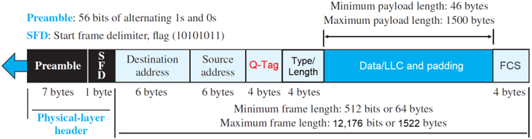
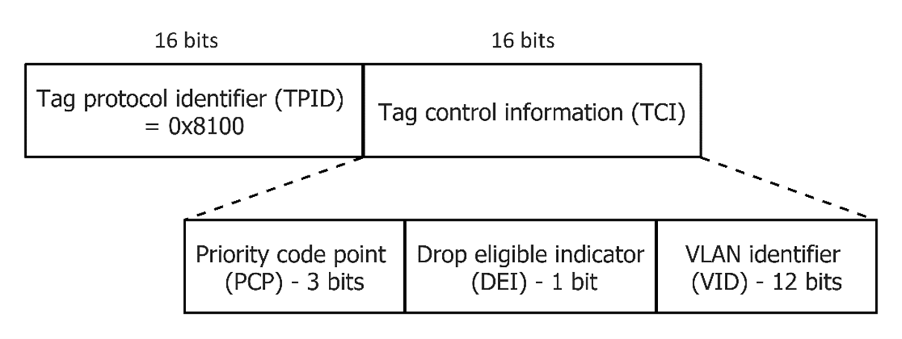
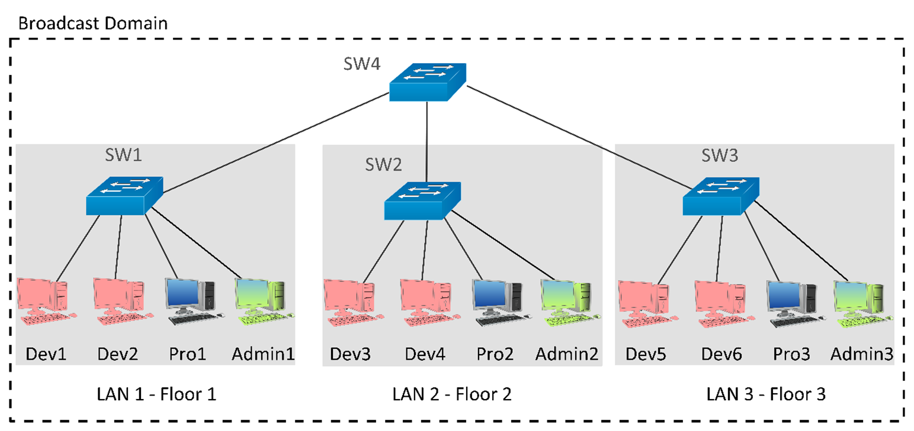
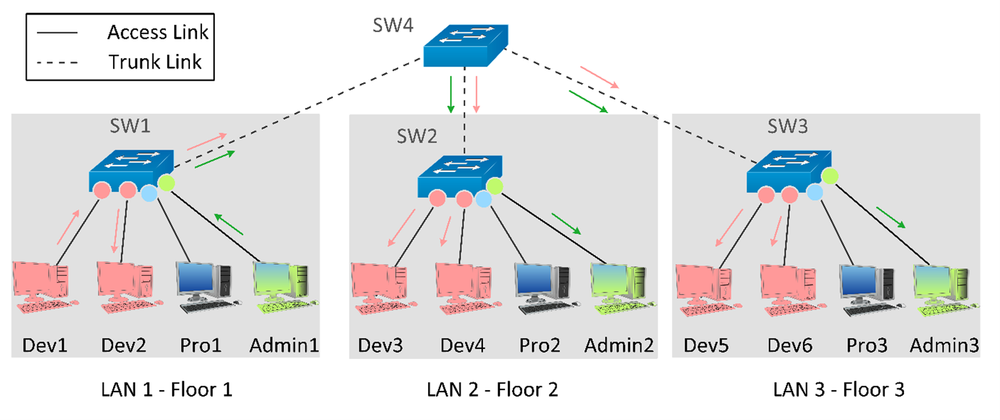
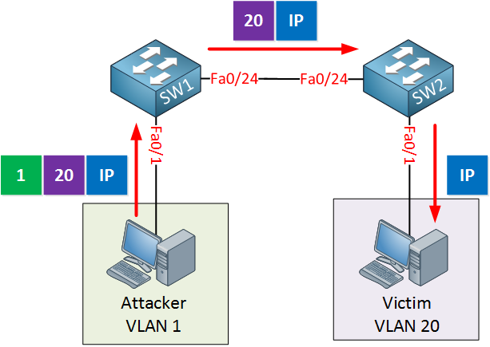
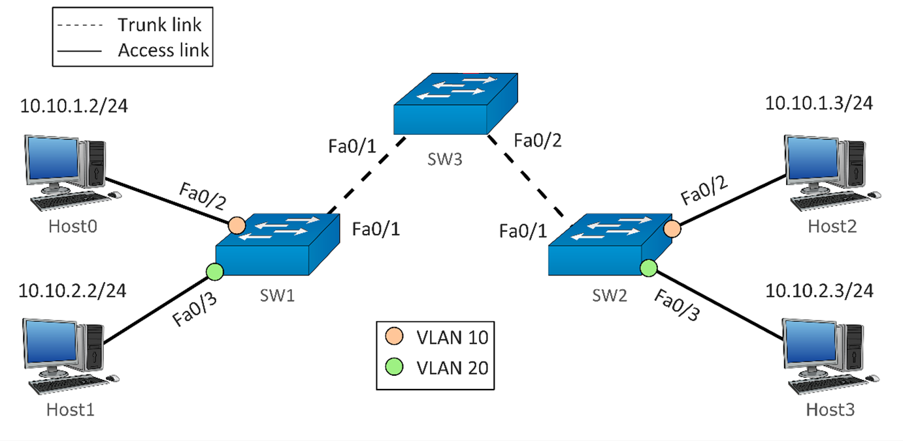
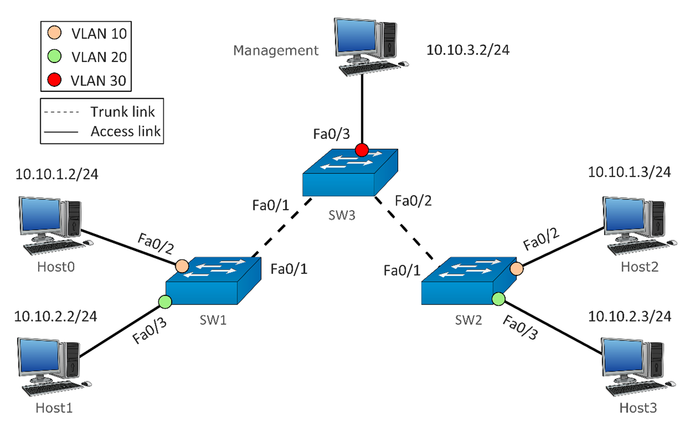
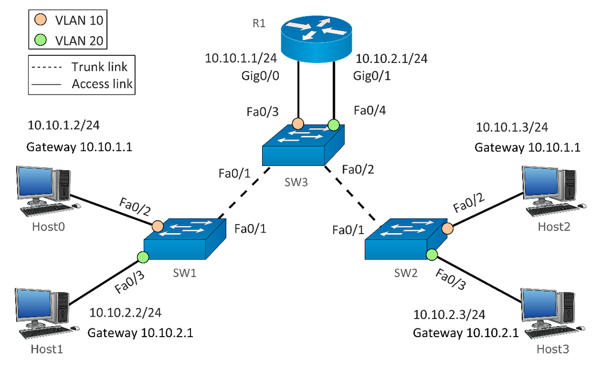
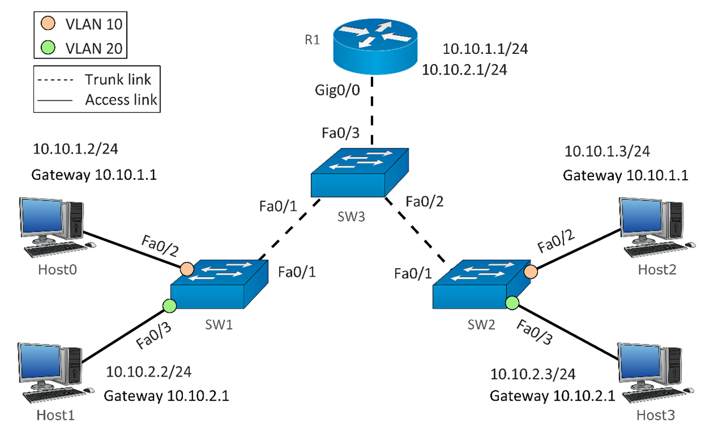
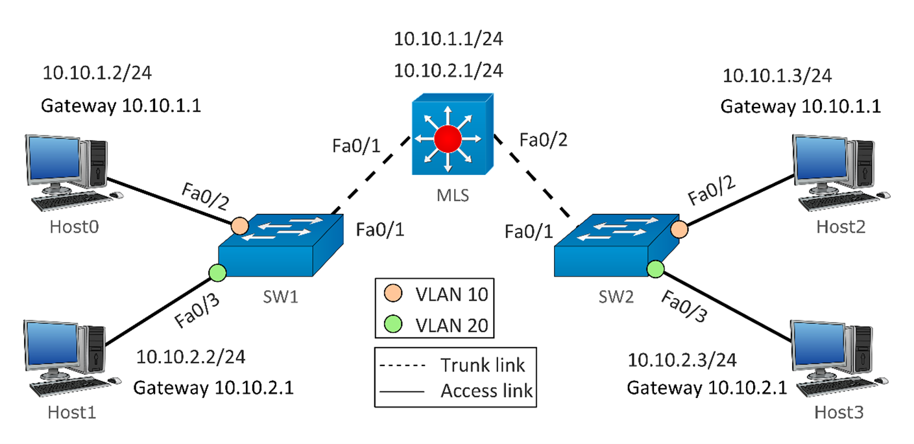

# Virtual Local Area Network (VLAN)

## The Foundation: Collision and Broadcast Domains

To understand the necessity of VLANs, it is essential to first define how devices communicate on a local network and the scaling challenges inherent in Layer 2 topologies.

- **Collision Domains**: In legacy hub-based networks, devices shared a single physical medium. If two devices transmitted data simultaneously, the electrical signals collided, resulting in corrupted frames. All ports on a hub share a single collision domain. Modern Layer 2 switches resolve this by assigning a dedicated collision domain to every individual port. The switch buffers and intelligently forwards frames, effectively eliminating collisions.

- **Broadcast Domains**: A broadcast domain is the logical boundary within which a broadcast frame is propagated. When a node needs to resolve an IP address to a MAC address (via ARP) or locate network services (via DHCP), it transmits a broadcast frame (destination MAC FF:FF:FF:FF:FF:FF). By default, a Layer 2 switch floods broadcast frames out of all interfaces except the ingress port.

In a standard, unsegmented switch topology, all ports belong to a single, unsegmented broadcast domain. If 500 hosts are connected, a single broadcast from one host forces the remaining 499 hosts to pause, receive, and process the frame. In large environments, this uncontrolled propagation consumes significant bandwidth and CPU cycles, degrading overall network performance.

## The Solution: Virtual Local Area Networks (VLANs)

A VLAN is a logical subdivision of a Layer 2 network. Instead of deploying separate physical switches for distinct organizational groups (e.g., Development, Production, and Administration), network administrators can configure a single physical switch to operate as multiple independent virtual switches.

- **Broadcast Isolation**: Assigning a switch port to a specific VLAN (e.g., VLAN 10) places it into a dedicated, isolated broadcast domain. Broadcast frames originating in VLAN 10 are only forwarded to other ports within VLAN 10. Devices in VLAN 20 remain entirely unaffected.

- **Logical Decoupling**: VLANs decouple the logical network topology from the physical wiring infrastructure. If an employee relocates to a different floor, physical rewiring is unnecessary; the administrator simply reassigns the user's new switch port to their designated VLAN, maintaining their logical network presence.

## VLAN Operations: 802.1Q Tagging and Port Roles

For switches to maintain logical separation across a multi-switch topology, they require a standardized method to track which frames belong to which VLANs. This is achieved using the IEEE 802.1Q standard (often called "Dot1Q"). When a frame traverses a link between switches, a 4-byte 802.1Q tag is inserted into the standard Ethernet frame header.

The Q-Tag is inserted between the source MAC address and the Type/Length fields of the original IEEE 802.3 frame. The minimum frame size is left unchanged at 64 bytes. The IEEE 802.3ac standard increased the maximum Ethernet frame size from 1,518 bytes to 1,522 bytes to accommodate the four-byte VLAN tag. Some network devices that do not support the larger frame size will process these frames successfully, but may report them as "baby giant" anomalies.

The Q-Tag structure is shown below. Two bytes are used for the **Tag Protocol Identifier (TPID)** and the other two bytes are used for **Tag Control Information (TCI)**. TPID is a fixed value of `0x8100` for standard 802.1Q VLANs. This field is located at the same position as the EtherType field in untagged Ethernet frames, and is thus used to distinguish the frame from untagged frames.

The TCI field is further divided into PCP, DEI, and VID.

- **VLAN Identifier (VID)**: A 12-bit field specifying the VLAN to which the frame belongs.

- **Priority Code Point (PCP)**: A 3-bit field used for Class of Service (CoS)/Quality of Service (QoS), allowing administrators to prioritize time-sensitive traffic, such as VoIP, over standard data payloads. Typical mapping: Voice traffic = PCP 5, Video = PCP 4, Best Effort = PCP 0.

- **Drop Eligible Indicator (DEI)**: A 1-bit field used in conjunction with PCP to indicate frames that are eligible to be dropped during network congestion. This field was formerly called Canonical Format Identifier (CFI) and enables Token Ring frames to be carried across Ethernet links easily.

### Port Types: Access vs. Trunk

To process both tagged and untagged traffic, switch interfaces are generally configured into one of two primary operational modes:

- **Access Ports**: These interfaces connect to end devices (e.g., workstations, servers, printers). Because standard end devices are typically unaware of VLANs, they expect untagged traffic. If they receive a tagged frame, they drop it as malformed. An access port belongs to a single VLAN; it strips the 802.1Q tag from egress traffic (leaving the switch) and applies the port's configured VLAN tag to ingress traffic (entering the switch).

- **Trunk Ports**: These interfaces connect switches to other switches or routers. A trunk port acts as a multiplexed link, capable of carrying traffic for multiple VLANs simultaneously. It preserves the 802.1Q tags on egress traffic so the receiving downstream switch can accurately identify and route the frames to their respective VLANs.

> The term **trunk** comes from telephony, where a trunk line carries multiple conversations simultaneously -- analogous to a network trunk carrying multiple VLANs.

### Frame Mechanics: FCS Recalculation

Every standard Ethernet frame ends with a **Frame Check Sequence** (FCS) trailer. The FCS is a checksum value used by receiving devices to verify that the frame was not corrupted during transit.

Because inserting the 4-byte 802.1Q tag fundamentally changes the frame's contents and size, the original FCS is no longer mathematically valid. Therefore, 802.1Q encapsulation forces a recalculation. When a switch receives an untagged frame on an access port, it takes apart the frame to insert the VLAN tag, recalculates a brand-new FCS to match the new payload, and appends it to the Ethernet trailer before sending the tagged frame out a trunk port.

## Real-World Application: Multi-Floor Corporate Network

### The Physical Topology and The Problem (Without VLANs)

Consider a three-story corporate facility housing three departments: Development (Dev), Production (Pro), and Administration (Admin). Workstations for each department are distributed across all three floors and connected to standard Layer 2 switches (SW1, SW2, SW3), which are aggregated by a core switch (SW4).

Without VLANs, this infrastructure functions as a single, flat broadcast domain. If a host (e.g., Dev1) transmits a broadcast frame, the switching fabric will flood it to every connected device across all floors. This topology introduces two critical issues:

- **Security and Isolation Limitations**: All departments share a single logical network. Without Layer 3 routing constraints, Development endpoints can directly access sensitive Production and Administration resources at Layer 2.

- **Physical Constraints**: In a flat topology, logical segmentation requires physical separation. Reassigning an employee from Floor 1 to Floor 2 necessitates physical rewiring to a department-specific switch, making network modifications labor-intensive and costly.

### The Logical Solution (With VLANs)

Implementing VLANs allows administrators to overlay logical boundaries onto the existing physical infrastructure.

Port assignments are segmented into three distinct VLANs:

- VLAN Dev (Red): Development department.
- VLAN Pro (Blue): Production department.
- VLAN Admin (Green): Administration department.

This configuration segments the single large broadcast domain into three isolated broadcast domains.

### Traffic Flow Mechanics

As illustrated above, the uplinks between the access switches and the core switch (SW4 to SW1/SW2/SW3) are configured as Trunk Links (dashed lines). The downstream connections to the workstations are configured as Access Links (solid lines) assigned to specific VLANs. If the Dev1 workstation on the first floor transmits a broadcast frame:

- **Ingress**: SW1 receives the untagged frame on a "Red" access port.

- **Local Forwarding and Tagging**: SW1 forwards the frame locally to Dev2 (also assigned to the Red VLAN). It then inserts the "Dev" 802.1Q tag into the frame header and forwards it out the trunk link toward SW4.

- **Trunk Transit**: SW4 reads the 802.1Q tag, recognizes the frame belongs to the Dev VLAN, and forwards it down the trunk links to SW2 and SW3.

- **Egress**: SW2 and SW3 receive the tagged frame. They strip the 802.1Q tag and forward the untagged frame exclusively out of their respective "Red" access ports (to Dev3/Dev4 and Dev5/Dev6).

Through this process, the Production and Administration workstations remain entirely isolated from the broadcast traffic. While the physical cabling remains static, device management becomes agile, restricted only by logical software configurations rather than hardware limitations.

## VLAN ID Ranges and Reservations

The 12-bit VID field provides a total of 4,096 possible values (0 to 4095). While this allows for massive network segmentation, the IEEE 802.1Q standard and various vendor implementations reserve specific identifiers for special purposes. Therefore, not all values are available for standard user assignment:

| Value    | Purpose                                           |
|----------|---------------------------------------------------|
| 0        | Reserved (priority-tagged frames only)            |
| 1 - 4094 | Available for standard VLAN assignment            |
| 4095     | Reserved (implementation use / wildcard matching) |

- **VID 0**: Indicates that the frame does not carry a specific VLAN ID but does carry QoS priority information (in the PCP and DEI fields). This is known as a "priority-tagged" frame.

- **VID 4095**: Strictly reserved by the 802.1Q standard for implementation use and cannot be configured or transmitted.

- **VID 1 – 4094**: Available for standard VLAN assignment.

> **Vendor Reservations:** Many switch vendors, such as Cisco or SONiC, reserve a small block of high-numbered VLANs (e.g., 3968–4094 or 1002–1005) for internal operations like routed ports.

> **The 4,094 Limit:** While VLANs are the standard for traditional enterprise networks, their 12-bit ID limits them to 4,094 networks, and they rely heavily on Spanning Tree Protocol (STP) which blocks redundant links and wastes bandwidth. For massive data centers and cloud providers, engineers now use VXLAN (Virtual Extensible LAN), which allows for 16 million network segments and routes over modern IP networks without STP blocking.

## Default VLAN

**VID 1** is the industry-standard default VLAN. When a switch is unboxed and powered on, all of its ports are initially assigned to VLAN 1 by default. Additionally, many switches use VLAN 1 to transmit standard control plane traffic (such as STP, CDP, or LLDP).

For security reasons, network best practices dictate that VLAN 1 should not be used for standard user data traffic. Instead, administrators should create dedicated, user-defined VLANs (from the 2–4094 range) and reassign access ports accordingly.

## Native VLAN

We have established that Trunk Ports multiplex traffic by applying an 802.1Q tag to every frame. However, a problem arises when a trunk port encounters traffic that does not have a tag. While trunk links expect tagged frames, they will occasionally receive untagged frames. This usually happens for two reasons:

- **Legacy Hardware**: An older, unmanaged switch or hub that does not understand 802.1Q might be sitting between two modern switches.

- **Control Protocols**: Certain network control protocols (like Spanning Tree Protocol or Cisco Discovery Protocol) naturally send their management traffic without VLAN tags.

When a switch receives an untagged frame on a trunk port, it needs to know which VLAN to put it in. It cannot simply guess. To solve this, every trunk port is assigned a Native VLAN. The Native VLAN is the designated "catch-all" VLAN whose sole purpose is to process untagged traffic traversing a trunk link.

### How Native VLANs Process Traffic

The native VLAN operates with a strict set of inbound and outbound rules:

- **Inbound (Receiving)**: When a trunk port receives an untagged frame, the switch immediately places that frame into the configured Native VLAN.

- **Outbound (Sending)**: When a switch needs to send a frame across a trunk, and that frame belongs to the Native VLAN, the switch explicitly strips the 802.1Q tag off and sends it untagged. Frames belonging to any other VLAN are sent with their tags intact.

### Critical Configuration Rules

Because the Native VLAN strips tags off outbound traffic, the Native VLAN must match exactly on both ends of a trunk link. If Switch A is configured with Native VLAN 1, and Switch B is configured with Native VLAN 10, an untagged frame sent by Switch A (intending to reach VLAN 1) will be received by Switch B and immediately dumped into VLAN 10. This is called a "Native VLAN Mismatch" and causes two separate, isolated networks to merge, causing severe routing errors and security breaches.

### Security Best Practices and "VLAN Hopping"

Out of the box, most switches use VLAN 1 as both the Default VLAN and the Native VLAN. This is a major security risk.

- **Default VLAN**: The VLAN all user access ports belong to at a factory reset.
- **Native VLAN**: The VLAN that sends traffic untagged across trunks.

If user access ports and the trunk's Native VLAN share the same number, malicious users can execute a Double-Tagging Attack (VLAN Hopping). For this to work, the attacker must be connected to an access port that belongs to the Native VLAN.

The attacker crafts a malicious frame with two 802.1Q tags. The switch reads the first (outer) tag. Because this tag matches the Native VLAN, the switch follows its outbound rule: it strips the first tag off and sends the frame across the trunk untagged. The receiving switch then receives the frame, reads the second (inner) tag that was hidden inside, and forwards it to the attacker's target VLAN, bypassing logical separation entirely.

> Always change the Native VLAN on your trunk ports to an unused, "dummy" network (e.g., VLAN 999), and ensure absolutely zero user access ports are assigned to it.

## The Golden Rule: One VLAN = One IP Subnet

Up to this point, we have discussed VLANs strictly as a Layer 2 (Data Link) technology. At Layer 2, switches use MAC addresses and 802.1Q tags to forward or isolate frames. A Layer 2 switch does not read, understand, or care about Layer 3 IP addresses. However, end-user devices rely on Layer 3 (Network) IP addresses and subnets to communicate. Because VLANs physically isolate broadcast domains at Layer 2, we must align our Layer 3 IP addressing scheme to match. This leads to the golden rule of network design: One VLAN = One IP Subnet.

An IP subnet is the Layer 3 equivalent of a broadcast domain. For a network to function correctly, the logical boundary at Layer 2 must perfectly mirror the logical boundary at Layer 3.

- **What happens if they don't match?** If you assign computers in VLAN 10 and VLAN 20 to the exact same IP subnet, they will assume they are on the same local network and try to communicate directly without a router. However, because they are on different VLANs, the Layer 2 switch will drop the traffic, and communication will fail completely.

- **The correct approach:** Every distinct VLAN must be assigned its own distinct, non-overlapping IP subnet. If a device in VLAN 10 wants to talk to a device in VLAN 20, the traffic must be sent to a Layer 3 Router (or Layer 3 Switch), which acts as a bridge between the two subnets. More on this topic later.

## Management VLAN

We have established that true [Out-of-Band (OOB)](./01a_README_MGMT.md#in-band-vs-out-of-band-management) management requires a completely separate, physically isolated network infrastructure. While OOB is standard for core servers and routers, running a secondary network of physical cables to every single access switch in a building is often cost-prohibitive. Therefore, network administrators must frequently rely on In-Band management (using the primary production network) to access their switches. To prevent regular users from accessing or interfering with these critical management interfaces, administrators utilize a Management VLAN.

A Management VLAN is a dedicated, logically isolated VLAN used exclusively to carry administrative traffic (such as SSH, SNMP, Syslog, and HTTPS) to and from network infrastructure devices.

### The Switch Virtual Interface (SVI)

For an administrator to remotely log into a switch via SSH, the switch itself must have an IP address. Because a Layer 2 switch does not typically have IP addresses on its physical ports, administrators create a virtual, internal interface called a **Switch Virtual Interface (SVI)**.

- The administrator assigns the SVI to the designated Management VLAN (e.g., VLAN 30).
- The administrator assigns an IP address to that SVI.
- The switch now restricts all management access exclusively to this VLAN.

### Real-World Example

In the following topology, the network is utilizing In-Band physical connections, but relies on a Management VLAN for logical isolation. Host0 and Host2 belong to VLAN 10 (Orange / 10.10.1.0/24). Host1 and Host3 belong to VLAN 20 (Green / 10.10.2.0/24). The IT Administrator's workstation is connected directly to SW3 on port Fa0/3, which is assigned to VLAN 30 (Red).

Even though the administrator's traffic travels across the exact same physical trunk links as the users, the 802.1Q tags ensure complete isolation. If the SVI on SW1 is configured for VLAN 30 with an IP of 10.10.3.11, the administrator (10.10.3.2) can safely SSH into SW1. The user hosts on VLAN 10 and 20 cannot see, ping, or access the switch's management interface, even though they are plugged into the same physical hardware.

### Why a Management VLAN is Critical

- **Security (Logical Isolation)**: It separates the "Management Plane" from the "Data Plane." Regular users, malware, or compromised workstations on data VLANs cannot accidentally or maliciously scan or brute-force the switch management interfaces.

- **Performance Protection**: High broadcast traffic or broadcast storms generated by users on the data VLANs will not flood the Management VLAN. This ensures the switch's CPU is not overwhelmed and remains responsive to IT commands.

- **Reliability**: Network management tools and monitoring software (SNMP) maintain dedicated logical bandwidth, ensuring alerts and logs are successfully transmitted even if the user VLANs are heavily congested.

## Inter-VLAN Communication

By design, VLANs isolate broadcast domains. Devices in different VLANs cannot communicate at Layer 2. If Host0 in VLAN 10 needs to send data to Host1 in VLAN 20, the traffic must be routed through a Layer 3 device (a Router or a Layer 3 Switch).

Because we followed the "One VLAN = One IP Subnet" rule, VLAN 10 and VLAN 20 operate on different network subnets. For a computer to send data to a different subnet, it must send that data to its Default Gateway: an IP address belonging to a Layer 3 router that knows how to reach the destination.

Historically, the networking industry has utilized three methods to provide these Default Gateways and route traffic between VLANs.

- Method 1: Traditional Inter-VLAN Routing (Physical Interfaces)
- Method 2: Router on a Stick (ROAS)
- Method 3: Layer 3 Switches with SVIs (The Modern Standard)

### Method 1: Traditional Inter-VLAN Routing (Physical Interfaces)

In the earliest days of VLANs, networks relied on standard external routers.

- The core switch (SW3) connects to the router (R1) using multiple physical cables.

- Each cable is configured as an Access Link assigned to a specific VLAN.

- The router has a dedicated physical port for each cable, and each port is assigned the IP address that serves as the Default Gateway for that specific VLAN (e.g., 10.10.1.1 for VLAN 10, 10.10.2.1 for VLAN 20).

**Traffic Flow:** Host0 sends traffic to SW1, up to SW3, and out to R1. R1 receives the data on the VLAN 10 port, routes it internally, and sends it back down the VLAN 20 port to reach Host1.

**Limitation:** This method does not scale. A router only has a limited number of physical ports. If your enterprise grows to require 50 VLANs, you would need 50 physical cables and a massively expensive router with 50 physical ports.

### Method 2: Router on a Stick (ROAS)

To solve the physical port limitation of the traditional method, engineers developed the "Router on a Stick" (ROAS) configuration.

- Instead of using multiple access cables, the switch connects to the router using a single, high-speed Trunk Link.

- The single physical interface on the router (Gig0/0) is divided in software into multiple logical Sub-Interfaces (e.g., Gig0/0.10 and Gig0/0.20).

- Each sub-interface is configured to listen for a specific 802.1Q VLAN tag and acts as the Default Gateway for that VLAN.

**Traffic Flow:** Traffic from VLAN 10 travels up the trunk link to the router. The router routes it to the VLAN 20 sub-interface, applies the VLAN 20 tag, and sends it down the exact same physical cable back to the switch.

**Limitation:** While ROAS solves the physical port shortage, it creates a bandwidth bottleneck. Because traffic must travel up to the router and back down the same cable, it effectively halves the available bandwidth of the link. If Host0 sends 1Gbps of data to Host1, the trunk link must process 2Gbps of traffic (1Gbps up, 1Gbps down).

> The term "Router on a Stick" (ROAS) comes directly from how the setup looks when drawn in network diagrams. Because this configuration uses only a single physical cable (the trunk link) to connect the router to the switch, engineers drawing the topology would draw a standard cylindrical router icon sitting on top of a single vertical line. Visually, this looks exactly like a lollipop, a popsicle, or a piece of food on a skewer. Rather than sticking to a dry, technical term like "single-arm router configuration," the networking community simply adopted this playful, literal description of the diagram.

### Method 3: Layer 3 Switches with SVIs (The Modern Standard)

To solve the bandwidth bottleneck, modern enterprise networks eliminate the external router entirely and use Layer 3 Switches (also known as Multilayer Switches, or MLS).

- A Layer 3 switch has dedicated routing hardware (ASICs) built directly into its silicon, allowing it to perform both Layer 2 switching and Layer 3 routing simultaneously.

- Administrators create internal software interfaces called Switch Virtual Interfaces (SVIs) one for each VLAN.

- These SVIs are assigned the Default Gateway IP addresses.

**Traffic Flow:** When Host0 wants to talk to Host1, the data goes up to the MLS. The switch's internal routing engine immediately routes the packet from the VLAN 10 SVI to the VLAN 20 SVI at hardware wire-speed, and sends it down to Host1.

This is the standard approach in modern data centers and enterprise networks. It offers vastly superior performance (wire-speed routing), eliminates the "hairpin" bottleneck of a Router on a Stick, and simplifies physical cabling.

> In modern Leaf-Spine data center fabrics, every "Leaf" switch is a Layer 3 switch. SVIs on the leaf provide the default gateway for each VLAN. Using advanced protocols like VXLAN and EVPN, this gateway is distributed across all leaves simultaneously (an "Anycast Gateway"), providing massive scale and redundancy.

## The Inherent Limitations of Traditional VLANs

While VLANs remain the standard for local campus networks, their foundational technologies introduce severe bottlenecks in modern data center infrastructure and large-scale cloud environments.

- **Limited Segment Scalability**: The 802.1Q standard allocates only 12 bits for the VLAN ID, resulting in a strict mathematical maximum of 4,094 usable networks. In multi-tenant environments or massive cloud deployments requiring tens of thousands of isolated segments, this address space is exhausted rapidly.

- **Spanning Tree Dependency and Bandwidth Waste**: VLANs operate at Layer 2 and inherently rely on the Spanning Tree Protocol (STP) to prevent broadcast loops. STP achieves this by blocking redundant physical links. In a network with multiple 100Gbps uplinks, STP will force some to sit entirely idle, severely wasting potential bandwidth. Furthermore, STP convergence after a topology change can disrupt traffic flow for anywhere from a few seconds (RSTP) to nearly a minute (classic STP).

- **Geographic and L3 Boundary Constraints**: Because VLANs are purely Layer 2 constructs, they rely on direct Layer 2 adjacency (switches connected via physical trunk links). Extending a single VLAN across geographically separated data centers over a routed Layer 3 network is traditionally complex, requiring heavy protocols like VPLS or OTV.

- **Management and Control Plane Overhead**: Network scalability is heavily burdened by STP. Each VLAN often requires its own STP instance (such as Per-VLAN Spanning Tree). As the VLAN count grows, the CPU and memory cycles required on every switch to maintain state for thousands of STP instances become unsustainable.

- **Inherent Security Vulnerabilities**: If not configured with strict port security, traditional VLANs are susceptible to VLAN Hopping attacks. A malicious actor can use Switch Spoofing to negotiate a trunk link and access all network traffic, or use Double Tagging to craft a frame with two 802.1Q tags, exploiting the Native VLAN to push traffic into an unauthorized, isolated subnet.

## Modern Data Center Fabrics: Overcoming VLAN Constraints

To overcome the scaling, bandwidth, and geographic limitations of traditional 802.1Q VLANs, the industry has shifted away from flat Layer 2 topologies. Instead, modern deployments (particularly those utilizing Top-of-Rack (ToR) provisioning and open network operating systems like SONiC) utilize a routed Layer 3 fabric paired with virtualization overlays.

### Leaf-Spine Architecture (The Physical Underlay)

The solution begins by discarding the traditional three-tier (Core, Distribution, Access) topology in favor of a Leaf-Spine (Clos) architecture. In this design, every Leaf switch connects to every Spine switch. Because the connections between the Spine and Leaf layers are strictly routed Layer 3 links, Spanning Tree Protocol is completely eliminated from the core fabric. Instead, all links are active simultaneously using [Equal-Cost Multi-Path (ECMP)](./02a_README_LB.md#ecmp-equal-cost-multi-pathing) routing, providing massive, predictable bandwidth and deterministic latency.

> Refer to [Topology Guide](./02_README_TOPOLOGY.md#the-modern-standard-leaf-spine-clos-topology) for full details.

### Network Virtualization with VXLAN (The Data Plane Overlay)

VXLAN (Virtual Extensible LAN) modernizes data center networking by functioning as a virtualized Layer 2 overlay that rides on top of a robust Layer 3 routed underlay. It works by encapsulating standard Layer 2 Ethernet frames inside UDP/IP packets, effectively hiding the original MAC-based traffic from the physical routing hardware. This encapsulation solves two critical bottlenecks of legacy networks: it utilizes a 24-bit VXLAN Network Identifier (VNI) to exponentially increase the maximum number of isolated network segments from 4,094 to over 16 million, and it allows these logical Layer 2 segments to be routed across standard IP networks, enabling engineers to stretch identical subnets across different physical racks or entirely separate data centers without relying on continuous, physical Layer 2 trunk links.

> Refer to [VXLAN Guide](./05_vxlan.md) for full details.

### BGP EVPN (The Control Plane)

Traditional VLANs rely on "flood-and-learn" mechanics to figure out where MAC addresses live, which wastes CPU and bandwidth. Ethernet VPN (EVPN) using the Border Gateway Protocol (BGP) acts as the intelligent control plane for VXLAN. Instead of flooding the network to find devices, switches use BGP to proactively advertise and share MAC and IP reachability information with each other. This enables highly advanced features like Distributed Anycast Gateways, where the default gateway IP address exists on every Top-of-Rack leaf switch simultaneously, routing traffic locally and instantly at the edge of the network.

> Refer to [EVPN Guide](./06_evpn.md) for full details.
